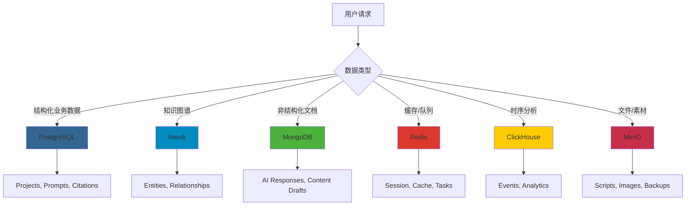

# Leap GEO 项目自动化开发资源指南

> 本文档详细说明如何利用全局配置的开发工具链来加速 Leap GEO 项目开发

## 📋 目录

1. [开发框架与方法论](#1-开发框架与方法论)
2. [MCP 服务器资源清单](#2-mcp-服务器资源清单)
3. [数据存储方案](#3-数据存储方案)
4. [自动化开发场景](#4-自动化开发场景)
5. [最佳实践工作流](#5-最佳实践工作流)

---

## 1. 开发框架与方法论

### 1.1 Context Engineering（上下文工程）

**位置**: `/Users/cavin/Context-Engineering-Intro`

**核心理念**: 通过提供全面的上下文信息，实现一次性实现成功（One-Pass Implementation）

**可用命令**:
```bash
/generate-prp [feature-file]  # 生成产品需求提示（PRP）
/execute-prp [prp-file]       # 执行PRP自动化开发
```

**在 Leap GEO 项目中的应用**:

#### 场景 1: 开发知识图谱API
```bash
# 步骤1: 创建功能需求文档 INITIAL.md
cat > INITIAL.md << 'EOF'
FEATURE: Neo4j Knowledge Graph API for GEO Platform
- CRUD operations for entities (Brand, Product, Feature, Problem, UserGroup)
- Relationship management (HAS_PRODUCT, HAS_FEATURE, SOLVES, etc.)
- GraphQL endpoint for frontend queries
- Cypher query optimization

EXAMPLES:
- /Users/cavin/Desktop/dev/leapgeo2/frontend/src/components/pages/KnowledgeGraph.tsx
- Neo4j official GraphQL library documentation

DOCUMENTATION:
- https://neo4j.com/docs/graphql-manual/current/
- https://neo4j.com/docs/cypher-manual/current/

OTHER CONSIDERATIONS:
- Use Neo4j MCP server (localhost:7688)
- Integrate with FastAPI backend
- Support real-time updates via WebSocket
EOF

# 步骤2: 生成实施蓝图
/generate-prp INITIAL.md

# 步骤3: 自动执行开发（含验证循环）
/execute-prp PRPs/knowledge-graph-api.md
```

**优势**:
- ✅ 自动研究代码库模式
- ✅ 收集相关文档和示例
- ✅ 创建带验证门的实施蓝图
- ✅ 置信度评分（1-10）
- ✅ 自我纠正循环

---

### 1.2 BMAD Method（敏捷业务模型开发）

**版本**: 4.44.1
**框架**: `bmad-context-engineering`
**工作流**: `agile-ai-driven`

**核心角色代理（10个）**:

| 角色 | 命令 | 职责 | Leap GEO 应用场景 |
|------|------|------|-------------------|
| **Analyst** | `/analyst` | 市场研究与需求分析 | 分析GEO行业竞品、目标用户画像 |
| **Architect** | `/architect` | 系统架构设计 | 设计微服务架构、API接口、数据库Schema |
| **PM** | `/pm` | 项目管理与规划 | 创建PRD、制定迭代计划 |
| **PO** | `/po` | 产品负责人 | 管理产品愿景、优先级排序 |
| **Dev** | `/dev` | 开发实施 | 实现具体功能模块 |
| **QA** | `/qa` | 质量保证与测试 | E2E测试、性能测试、安全测试 |
| **SM** | `/sm` | Scrum Master | 敏捷流程管理、创建故事卡 |
| **UX Expert** | `/ux-expert` | UX/UI 设计专家 | 优化用户体验、设计交互流程 |
| **BMAD Orchestrator** | `/bmad-orchestrator` | 工作流协调 | 协调多角色协同工作 |
| **BMAD Master** | `/bmad-master` | 复杂任务编排 | 端到端功能开发 |

---

### 1.3 SuperClaude 命令（17个）

**位置**: `/Users/cavin/.claude/commands/sc/`

| 命令 | 功能 | 在 Leap GEO 中的应用 |
|------|------|---------------------|
| `/sc:analyze` | 代码质量、安全、性能分析 | 分析React组件性能瓶颈、检测安全漏洞 |
| `/sc:build` | 构建、编译、打包 | 前端生产构建、后端Docker镜像构建 |
| `/sc:cleanup` | 清理死代码、优化结构 | 移除未使用的组件、优化import语句 |
| `/sc:design` | 系统架构与API设计 | 设计Citation Tracking API、Prompt评分算法 |
| `/sc:document` | 创建专注的文档 | 生成API文档、组件文档、部署文档 |
| `/sc:estimate` | 开发时间估算 | 估算新功能开发周期 |
| `/sc:explain` | 代码和概念解释 | 解释GEO算法、知识图谱逻辑 |
| `/sc:git` | Git智能操作 | 智能commit、创建PR、管理分支 |
| `/sc:implement` | 功能实现（含MCP集成） | 实现多品牌筛选、内容生成器 |
| `/sc:improve` | 系统化代码改进 | 优化Prompt评分算法、提升Citation Rate计算效率 |
| `/sc:index` | 生成项目文档和知识库 | 创建完整的代码文档索引 |
| `/sc:load` | 加载和分析项目上下文 | 快速了解项目结构和依赖关系 |
| `/sc:spawn` | 分解任务为协调子任务 | 将大功能拆分为可并行的小任务 |
| `/sc:task` | 执行复杂任务（跨会话持久化） | 长期开发任务管理 |
| `/sc:test` | 执行测试、生成报告 | E2E测试、单元测试、覆盖率报告 |
| `/sc:troubleshoot` | 诊断和解决问题 | 调试空白页问题、修复CSS overflow |
| `/sc:workflow` | 从PRD生成实施工作流 | 基于产品需求生成开发步骤 |

---

## 2. MCP 服务器资源清单

### 2.1 🗄️ 数据库层（6个）

#### PostgreSQL（关系型数据库）✅ 核心依赖

**配置信息**:
```bash
端口: 5437
容器: postgres-claude-mcp
用户名: claude
密码: claude_dev_2025
数据库: claude_dev
状态: Running
```

**在 Leap GEO 中的应用**:
```sql
-- 核心业务表设计
CREATE TABLE projects (
  id VARCHAR PRIMARY KEY,
  name VARCHAR NOT NULL,
  industry VARCHAR,
  citation_rate DECIMAL(5,2),
  total_prompts INT,
  content_published INT,
  status VARCHAR CHECK (status IN ('active', 'paused', 'completed')),
  created_at TIMESTAMP DEFAULT NOW()
);

CREATE TABLE prompts (
  id SERIAL PRIMARY KEY,
  project_id VARCHAR REFERENCES projects(id),
  text TEXT NOT NULL,
  intent VARCHAR,  -- High-Intent, Educational, etc.
  priority VARCHAR CHECK (priority IN ('P0', 'P1', 'P2')),
  score INTEGER CHECK (score BETWEEN 0 AND 100),
  citation_rate DECIMAL(5,2),
  status VARCHAR DEFAULT 'active',
  platforms TEXT[],  -- ['YouTube', 'Reddit', 'Quora']
  created_at TIMESTAMP DEFAULT NOW()
);

CREATE TABLE citations (
  id SERIAL PRIMARY KEY,
  prompt_id INTEGER REFERENCES prompts(id),
  platform VARCHAR,  -- ChatGPT, Claude, Perplexity, etc.
  source TEXT,
  position INTEGER,
  snippet TEXT,
  detected_at TIMESTAMP DEFAULT NOW()
);

CREATE TABLE contents (
  id SERIAL PRIMARY KEY,
  prompt_id INTEGER REFERENCES prompts(id),
  platform VARCHAR,
  content_type VARCHAR,  -- video, article, q&a, etc.
  title TEXT,
  body TEXT,
  url TEXT,
  performance_score INTEGER,
  published_at TIMESTAMP
);

-- 索引优化
CREATE INDEX idx_prompts_project ON prompts(project_id);
CREATE INDEX idx_citations_platform ON citations(platform);
CREATE INDEX idx_citations_detected ON citations(detected_at);
CREATE INDEX idx_contents_prompt ON contents(prompt_id);
```

**使用示例**:
```javascript
// 查询项目Citation Rate趋势
const trendData = await postgresql.query(`
  SELECT
    DATE(detected_at) as date,
    platform,
    COUNT(*) as citation_count,
    AVG(position) as avg_position
  FROM citations c
  JOIN prompts p ON c.prompt_id = p.id
  WHERE p.project_id = $1
    AND detected_at >= NOW() - INTERVAL '30 days'
  GROUP BY DATE(detected_at), platform
  ORDER BY date DESC
`, [projectId]);
```

---

#### Neo4j（图数据库）✅ 核心依赖

**配置信息**:
```bash
端口: 7688 (Bolt), 7475 (HTTP)
容器: neo4j-claude-mcp
用户名: neo4j
密码: claude_neo4j_2025
浏览器: http://localhost:7475
状态: Running
```

**在 Leap GEO 中的应用**:

**知识图谱结构**:
```cypher
// 创建实体类型约束
CREATE CONSTRAINT brand_id IF NOT EXISTS FOR (b:Brand) REQUIRE b.id IS UNIQUE;
CREATE CONSTRAINT product_id IF NOT EXISTS FOR (p:Product) REQUIRE p.id IS UNIQUE;
CREATE CONSTRAINT feature_id IF NOT EXISTS FOR (f:Feature) REQUIRE f.id IS UNIQUE;

// 构建 SweetNight 知识图谱
CREATE (b:Brand {
  id: 'sweetnight',
  name: 'SweetNight',
  industry: 'Sleep Products',
  founded: 2018
})

CREATE (p1:Product {
  id: 'coolnest',
  name: 'CoolNest Mattress',
  price_range: '$800-$1200',
  warranty_years: 10
})

CREATE (f1:Feature {
  id: 'cooling-tech',
  name: 'Cooling Technology',
  description: 'Advanced gel-infused memory foam',
  importance: 'high'
})

CREATE (f2:Feature {
  id: 'motion-isolation',
  name: 'Motion Isolation',
  description: 'Zero partner disturbance',
  importance: 'medium'
})

CREATE (prob1:Problem {
  id: 'hot-sleep',
  name: 'Hot Sleep',
  severity: 'high',
  affected_percentage: 35
})

CREATE (prob2:Problem {
  id: 'back-pain',
  name: 'Back Pain',
  severity: 'high',
  affected_percentage: 45
})

CREATE (ug1:UserGroup {
  id: 'athletes',
  name: 'Athletes',
  size_estimate: '2M',
  pain_points: ['recovery', 'temperature']
})

CREATE (ug2:UserGroup {
  id: 'side-sleepers',
  name: 'Side Sleepers',
  size_estimate: '15M',
  pain_points: ['pressure', 'alignment']
})

// 创建关系
CREATE (b)-[:HAS_PRODUCT]->(p1)
CREATE (p1)-[:HAS_FEATURE]->(f1)
CREATE (p1)-[:HAS_FEATURE]->(f2)
CREATE (f1)-[:SOLVES]->(prob1)
CREATE (f2)-[:SOLVES]->(prob2)
CREATE (ug1)-[:HAS_PROBLEM]->(prob1)
CREATE (ug2)-[:HAS_PROBLEM]->(prob2)
CREATE (ug1)-[:NEEDS]->(f1)
CREATE (ug2)-[:NEEDS]->(f2)
```

**高级查询示例**:
```cypher
// 查询：为特定用户群推荐产品特性
MATCH path = (ug:UserGroup {id: 'athletes'})
             -[:HAS_PROBLEM]->(prob:Problem)
             <-[:SOLVES]-(feature:Feature)
             <-[:HAS_FEATURE]-(product:Product)
             <-[:HAS_PRODUCT]-(brand:Brand)
WHERE brand.id = 'sweetnight'
RETURN brand.name, product.name, feature.name, prob.name,
       feature.importance as priority
ORDER BY feature.importance DESC

// 查询：计算产品的Problem-Solution Coverage
MATCH (product:Product {id: 'coolnest'})-[:HAS_FEATURE]->(f:Feature)-[:SOLVES]->(p:Problem)
WITH product, COUNT(DISTINCT p) as solved_problems
MATCH (all_problems:Problem)
WITH product, solved_problems, COUNT(all_problems) as total_problems
RETURN product.name,
       solved_problems,
       total_problems,
       (solved_problems * 100.0 / total_problems) as coverage_percentage

// 查询：找出最受欢迎的特性组合
MATCH (ug:UserGroup)-[:NEEDS]->(f:Feature)<-[:HAS_FEATURE]-(p:Product)
WITH f, COUNT(DISTINCT ug) as user_groups_count, COLLECT(DISTINCT ug.name) as user_groups
RETURN f.name, user_groups_count, user_groups
ORDER BY user_groups_count DESC
LIMIT 5
```

**GraphQL Schema 生成**:
```javascript
// 使用 @neo4j/graphql 自动生成GraphQL API
const typeDefs = `
  type Brand {
    id: ID!
    name: String!
    industry: String
    products: [Product!]! @relationship(type: "HAS_PRODUCT", direction: OUT)
  }

  type Product {
    id: ID!
    name: String!
    brand: Brand! @relationship(type: "HAS_PRODUCT", direction: IN)
    features: [Feature!]! @relationship(type: "HAS_FEATURE", direction: OUT)
  }

  type Feature {
    id: ID!
    name: String!
    importance: String
    solves: [Problem!]! @relationship(type: "SOLVES", direction: OUT)
    products: [Product!]! @relationship(type: "HAS_FEATURE", direction: IN)
  }

  type Problem {
    id: ID!
    name: String!
    severity: String
    solvedBy: [Feature!]! @relationship(type: "SOLVES", direction: IN)
    affectsUserGroups: [UserGroup!]! @relationship(type: "HAS_PROBLEM", direction: IN)
  }

  type UserGroup {
    id: ID!
    name: String!
    sizeEstimate: String
    problems: [Problem!]! @relationship(type: "HAS_PROBLEM", direction: OUT)
    needs: [Feature!]! @relationship(type: "NEEDS", direction: OUT)
  }
`;
```

---

#### MongoDB（文档数据库）

**配置信息**:
```bash
端口: 27018
容器: mongodb-claude-mcp
用户名: claude
密码: claude_mongo_2025
数据库: claude_dev
状态: Running
```

**在 Leap GEO 中的应用**:
```javascript
// 存储AI生成的原始内容草稿
db.content_drafts.insertOne({
  prompt_id: 156,
  project_id: "sweetnight",
  platform: "YouTube",
  content_type: "video_script",
  generated_at: new Date(),
  model: "gpt-4o",
  prompt_template: "Compare SweetNight CoolNest vs {competitor} for {user_group}",
  variables: {
    competitor: "Tempur-Pedic",
    user_group: "athletes"
  },
  raw_output: {
    title: "SweetNight CoolNest vs Tempur-Pedic: Which is Better for Athletes?",
    intro: "...",
    sections: [
      {
        heading: "Cooling Technology Comparison",
        content: "..."
      }
    ],
    conclusion: "..."
  },
  metadata: {
    word_count: 1850,
    estimated_duration: "8:30",
    geo_score: 92,
    keyword_density: {
      "cooling mattress": 12,
      "athlete recovery": 8,
      "temperature regulation": 10
    }
  },
  status: "pending_review"
});

// 存储AI平台响应原始数据
db.ai_platform_responses.insertOne({
  platform: "ChatGPT",
  prompt: "best cooling mattress for athletes 2025",
  response_html: "<html>...</html>",
  citations: [
    {
      title: "SweetNight CoolNest Review - YouTube",
      url: "https://youtube.com/...",
      position: 2,
      snippet: "..."
    }
  ],
  detected_at: new Date(),
  query_metadata: {
    user_location: "US",
    device_type: "desktop",
    session_id: "abc123"
  }
});

// 复杂聚合分析
db.content_drafts.aggregate([
  { $match: { project_id: "sweetnight", status: "published" } },
  { $group: {
      _id: "$platform",
      avg_geo_score: { $avg: "$metadata.geo_score" },
      total_content: { $sum: 1 },
      avg_word_count: { $avg: "$metadata.word_count" }
    }
  },
  { $sort: { avg_geo_score: -1 } }
]);
```

---

#### Redis（缓存与消息队列）

**配置信息**:
```bash
端口: 6382
容器: redis-claude-mcp
密码: claude_redis_2025
持久化: AOF enabled
状态: Running
```

**在 Leap GEO 中的应用**:
```javascript
// 1. 缓存 Citation Rate 实时统计
await redis.setex(
  `citation_rate:sweetnight:${today}`,
  3600,  // 1小时缓存
  JSON.stringify({
    rate: 0.32,
    total_citations: 145,
    total_queries: 453,
    by_platform: {
      "ChatGPT": 0.35,
      "Claude": 0.28,
      "Perplexity": 0.41
    }
  })
);

// 2. Celery 任务队列（内容生成）
// Producer
await redis.lpush('celery:queue:content_generation', JSON.stringify({
  task_id: uuid(),
  prompt_id: 156,
  platform: "YouTube",
  priority: "high"
}));

// Consumer
const task = await redis.brpop('celery:queue:content_generation', 0);

// 3. 实时排行榜（Top Performing Prompts）
await redis.zadd(
  'leaderboard:prompts:citation_rate',
  0.45,  // score
  'prompt:156'
);

// 获取Top 10
const topPrompts = await redis.zrevrange(
  'leaderboard:prompts:citation_rate',
  0,
  9,
  'WITHSCORES'
);

// 4. 分布式锁（防止重复抓取）
const lockKey = `lock:scrape:ChatGPT:${promptId}`;
const acquired = await redis.setnx(lockKey, 1);
if (acquired) {
  await redis.expire(lockKey, 300);  // 5分钟锁定
  // 执行抓取任务
  await scrapeCitations();
  await redis.del(lockKey);
}

// 5. Session管理（用户登录状态）
await redis.setex(
  `session:${userId}`,
  86400,  // 24小时
  JSON.stringify({
    user_id: userId,
    project_id: 'sweetnight',
    permissions: ['read', 'write'],
    last_activity: new Date()
  })
);

// 6. 限流（Rate Limiting）
const key = `rate_limit:api:${userId}:${endpoint}`;
const current = await redis.incr(key);
if (current === 1) {
  await redis.expire(key, 60);  // 1分钟窗口
}
if (current > 100) {
  throw new Error('Rate limit exceeded');
}
```

---

#### ClickHouse（时序分析）待集成

**在 Leap GEO 中的应用**:
```sql
-- 创建事件表（高性能时序数据）
CREATE TABLE citation_events (
  event_time DateTime,
  project_id String,
  prompt_id UInt32,
  platform String,
  source String,
  position UInt8,
  detected_at DateTime
) ENGINE = MergeTree()
PARTITION BY toYYYYMM(event_time)
ORDER BY (project_id, platform, event_time);

-- 高效查询 Citation 趋势
SELECT
  toStartOfDay(event_time) as date,
  platform,
  count() as citations,
  avg(position) as avg_position,
  uniq(prompt_id) as unique_prompts
FROM citation_events
WHERE project_id = 'sweetnight'
  AND event_time >= now() - INTERVAL 30 DAY
GROUP BY date, platform
ORDER BY date DESC;

-- 用户行为分析
CREATE TABLE user_interactions (
  event_time DateTime,
  user_id String,
  project_id String,
  action String,  -- view_prompt, edit_content, publish, etc.
  page String,
  duration UInt32,  -- seconds
  metadata String  -- JSON
) ENGINE = MergeTree()
ORDER BY (user_id, event_time);

-- 页面性能分析
SELECT
  page,
  count() as views,
  avg(duration) as avg_duration,
  quantile(0.95)(duration) as p95_duration
FROM user_interactions
WHERE event_time >= today()
GROUP BY page
ORDER BY views DESC;
```

---

#### Prisma（现代ORM）

**在 Leap GEO 中的应用**:
```prisma
// schema.prisma
datasource db {
  provider = "postgresql"
  url      = env("DATABASE_URL")
}

generator client {
  provider = "prisma-client-js"
}

model Project {
  id               String   @id @default(uuid())
  name             String
  industry         String?
  citationRate     Float?   @map("citation_rate")
  totalPrompts     Int      @default(0) @map("total_prompts")
  contentPublished Int      @default(0) @map("content_published")
  status           Status   @default(active)
  createdAt        DateTime @default(now()) @map("created_at")
  updatedAt        DateTime @updatedAt @map("updated_at")

  prompts          Prompt[]

  @@map("projects")
}

model Prompt {
  id           Int      @id @default(autoincrement())
  projectId    String   @map("project_id")
  text         String
  intent       String?
  priority     Priority @default(P2)
  score        Int?     @default(0)
  citationRate Float?   @map("citation_rate")
  status       String   @default("active")
  platforms    String[]
  createdAt    DateTime @default(now()) @map("created_at")

  project      Project  @relation(fields: [projectId], references: [id])
  citations    Citation[]
  contents     Content[]

  @@index([projectId])
  @@map("prompts")
}

model Citation {
  id          Int      @id @default(autoincrement())
  promptId    Int      @map("prompt_id")
  platform    String
  source      String
  position    Int
  snippet     String?
  detectedAt  DateTime @default(now()) @map("detected_at")

  prompt      Prompt   @relation(fields: [promptId], references: [id])

  @@index([platform])
  @@index([detectedAt])
  @@map("citations")
}

enum Status {
  active
  paused
  completed
}

enum Priority {
  P0
  P1
  P2
}
```

**使用示例**:
```typescript
import { PrismaClient } from '@prisma/client';

const prisma = new PrismaClient();

// 创建项目并关联Prompts
const project = await prisma.project.create({
  data: {
    name: "SweetNight Mattress",
    industry: "Sleep Products",
    prompts: {
      create: [
        {
          text: "best cooling mattress for hot sleepers 2025",
          intent: "High-Intent",
          priority: "P0",
          score: 92,
          platforms: ["YouTube", "Reddit", "Quora"]
        }
      ]
    }
  },
  include: {
    prompts: true
  }
});

// 复杂查询：获取高性能Prompts及其Citations
const topPrompts = await prisma.prompt.findMany({
  where: {
    projectId: projectId,
    score: { gte: 80 },
    citationRate: { gte: 0.25 }
  },
  include: {
    citations: {
      orderBy: { detectedAt: 'desc' },
      take: 10
    },
    project: true
  },
  orderBy: {
    citationRate: 'desc'
  }
});

// 聚合分析
const stats = await prisma.citation.groupBy({
  by: ['platform'],
  where: {
    prompt: {
      projectId: projectId
    },
    detectedAt: {
      gte: new Date(Date.now() - 30 * 24 * 60 * 60 * 1000)
    }
  },
  _count: {
    id: true
  },
  _avg: {
    position: true
  }
});
```

---

### 2.2 🌐 Web 自动化层（3个）

#### Firecrawl（自建Docker服务）✅ 关键能力

**配置信息**:
```bash
位置: /Users/cavin/firecrawl
端口: 3002 (API), 5434 (PostgreSQL)
API Key: fs-test
管理UI: http://localhost:3002/admin/@/queues
服务: API, PostgreSQL, Playwright, Redis
启动: cd ~/firecrawl && docker compose up -d
```

**在 Leap GEO 中的应用**:

**场景 1: 批量抓取8个AI平台的Citation数据**
```javascript
import FirecrawlApp from '@mendable/firecrawl-js';

const firecrawl = new FirecrawlApp({
  apiUrl: 'http://localhost:3002',
  apiKey: 'fs-test'
});

// AI平台列表
const platforms = [
  { name: 'ChatGPT', searchUrl: 'https://chat.openai.com/...' },
  { name: 'Claude', searchUrl: 'https://claude.ai/...' },
  { name: 'Perplexity', searchUrl: 'https://perplexity.ai/...' },
  { name: 'Gemini', searchUrl: 'https://gemini.google.com/...' },
  { name: 'Copilot', searchUrl: 'https://copilot.microsoft.com/...' },
  { name: 'You.com', searchUrl: 'https://you.com/...' },
  { name: 'Phind', searchUrl: 'https://www.phind.com/...' },
  { name: 'Anthropic', searchUrl: 'https://www.anthropic.com/...' }
];

// 批量抓取函数
async function scrapeCitationsForPrompt(prompt) {
  const results = [];

  for (const platform of platforms) {
    try {
      const url = platform.searchUrl.replace('{query}', encodeURIComponent(prompt.text));

      const response = await firecrawl.scrapeUrl(url, {
        formats: ['markdown', 'html'],
        waitFor: 5000,
        actions: [
          { type: 'wait', milliseconds: 3000 },
          { type: 'scroll', direction: 'down' },
          { type: 'screenshot' }
        ],
        extractorOptions: {
          mode: 'llm-extraction',
          extractionPrompt: `
            Extract all citations/sources mentioned in the AI response.
            For each citation, extract:
            - title
            - url
            - position (1-indexed from top)
            - snippet (short excerpt showing context)
          `
        }
      });

      // 解析Citations
      const citations = response.llm_extraction?.citations || [];

      // 过滤出SweetNight相关引用
      const sweetNightCitations = citations.filter(c =>
        c.title.toLowerCase().includes('sweetnight') ||
        c.url.includes('sweetnight') ||
        c.snippet.toLowerCase().includes('sweetnight')
      );

      // 存储到PostgreSQL
      for (const citation of sweetNightCitations) {
        await postgresql.insert('citations', {
          prompt_id: prompt.id,
          platform: platform.name,
          source: citation.title,
          position: citation.position,
          snippet: citation.snippet,
          url: citation.url,
          detected_at: new Date()
        });
      }

      // 存储原始响应到MongoDB
      await mongodb.insertOne('ai_platform_responses', {
        platform: platform.name,
        prompt: prompt.text,
        response_html: response.html,
        response_markdown: response.markdown,
        screenshot_url: response.screenshot,
        citations: citations,
        detected_at: new Date()
      });

      results.push({
        platform: platform.name,
        citationsFound: sweetNightCitations.length,
        totalSources: citations.length
      });

    } catch (error) {
      console.error(`Error scraping ${platform.name}:`, error);
      results.push({
        platform: platform.name,
        error: error.message
      });
    }
  }

  return results;
}

// 定时任务：每天扫描所有P0 Prompts
async function dailyCitationScan() {
  const p0Prompts = await postgresql.query(`
    SELECT * FROM prompts
    WHERE priority = 'P0'
    AND status = 'active'
    ORDER BY score DESC
  `);

  for (const prompt of p0Prompts) {
    const results = await scrapeCitationsForPrompt(prompt);

    // 计算Citation Rate
    const totalCitations = results.reduce((sum, r) => sum + (r.citationsFound || 0), 0);
    const totalPlatforms = results.filter(r => !r.error).length;
    const citationRate = totalCitations / totalPlatforms;

    // 更新Prompt的Citation Rate
    await postgresql.query(`
      UPDATE prompts
      SET citation_rate = $1, updated_at = NOW()
      WHERE id = $2
    `, [citationRate, prompt.id]);

    // 缓存结果到Redis
    await redis.setex(
      `citation_scan:${prompt.id}:${today}`,
      86400,  // 24小时
      JSON.stringify(results)
    );
  }
}
```

**场景 2: 竞品分析 - 批量抓取Reddit/Quora讨论**
```javascript
// 批量抓取Reddit相关讨论
const redditUrls = [
  'https://reddit.com/r/Mattress/search?q=cooling+mattress',
  'https://reddit.com/r/Mattress/search?q=hot+sleepers',
  'https://reddit.com/r/Fitness/search?q=athlete+mattress'
];

const batchResults = await firecrawl.batchScrapeUrls(redditUrls, {
  formats: ['markdown'],
  onlyMainContent: true,
  waitFor: 3000
});

// 分析提及的品牌
const brandMentions = {};
for (const result of batchResults) {
  const brands = ['sweetnight', 'tempur-pedic', 'purple', 'casper'];
  for (const brand of brands) {
    const regex = new RegExp(brand, 'gi');
    const matches = (result.markdown.match(regex) || []).length;
    brandMentions[brand] = (brandMentions[brand] || 0) + matches;
  }
}

console.log('Brand Share of Voice:', brandMentions);
```

**场景 3: 内容发布监控**
```javascript
// 监控YouTube视频发布状态
async function monitorContentPublication(contentId) {
  const content = await postgresql.query(
    'SELECT * FROM contents WHERE id = $1',
    [contentId]
  );

  if (content.url) {
    const result = await firecrawl.scrapeUrl(content.url, {
      formats: ['markdown'],
      waitFor: 2000
    });

    // 检查视频状态
    const isPublic = result.markdown.includes('views') &&
                     !result.markdown.includes('Private');

    if (isPublic) {
      // 提取性能指标
      const viewsMatch = result.markdown.match(/(\d+(?:,\d+)*)\s+views/);
      const likesMatch = result.markdown.match(/(\d+(?:,\d+)*)\s+likes/);

      await postgresql.query(`
        UPDATE contents
        SET
          views = $1,
          likes = $2,
          last_checked = NOW()
        WHERE id = $3
      `, [
        viewsMatch ? parseInt(viewsMatch[1].replace(/,/g, '')) : 0,
        likesMatch ? parseInt(likesMatch[1].replace(/,/g, '')) : 0,
        contentId
      ]);
    }
  }
}
```

---

#### Puppeteer（浏览器自动化）

**在 Leap GEO 中的应用**:
```javascript
// E2E测试前端组件
test('Citation Tracking Dashboard loads correctly', async ({ page }) => {
  await page.goto('http://localhost:5173');

  // 导航到Citations页面
  await page.click('button:has-text("AI Citations")');

  // 等待数据加载
  await page.waitForSelector('.citation-card');

  // 验证Citation卡片数量
  const citationCount = await page.locator('.citation-card').count();
  expect(citationCount).toBeGreaterThan(0);

  // 点击平台筛选
  await page.click('button:has-text("Perplexity")');

  // 验证筛选后的结果
  await page.waitForTimeout(500);
  const perplexityCitations = await page
    .locator('.citation-card:has-text("Perplexity")')
    .count();
  expect(perplexityCitations).toBe(citationCount);

  // 截图保存
  await page.screenshot({
    path: 'test-results/citations-page.png',
    fullPage: true
  });
});

// 自动化登录9个平台并发布内容
async function publishToAllPlatforms(content) {
  const platforms = [
    {
      name: 'YouTube',
      login: async (page) => {
        await page.goto('https://studio.youtube.com');
        // 登录逻辑...
      },
      publish: async (page) => {
        await page.click('button[aria-label="Create"]');
        await page.click('text=Upload video');
        // 发布逻辑...
      }
    },
    {
      name: 'Reddit',
      login: async (page) => {
        await page.goto('https://reddit.com/login');
        // 登录逻辑...
      },
      publish: async (page) => {
        await page.goto('https://reddit.com/r/Mattress/submit');
        await page.fill('textarea[name="title"]', content.title);
        await page.fill('textarea[name="text"]', content.body);
        await page.click('button:has-text("Post")');
      }
    }
    // ... 其他7个平台
  ];

  for (const platform of platforms) {
    const browser = await chromium.launch();
    const page = await browser.newPage();

    try {
      await platform.login(page);
      await platform.publish(page);

      // 记录发布成功
      await postgresql.query(`
        UPDATE contents
        SET status = 'published', published_at = NOW()
        WHERE id = $1 AND platform = $2
      `, [content.id, platform.name]);

    } catch (error) {
      console.error(`Failed to publish to ${platform.name}:`, error);
    } finally {
      await browser.close();
    }
  }
}
```

---

#### Chrome DevTools

**在 Leap GEO 中的应用**:
```javascript
// 性能分析：前端加载时间
const performanceMetrics = await chromeDevTools.getPerformanceMetrics();
console.log('First Contentful Paint:', performanceMetrics.fcp);
console.log('Largest Contentful Paint:', performanceMetrics.lcp);

// 网络请求调试
const networkLogs = await chromeDevTools.getNetworkLogs();
const slowRequests = networkLogs.filter(req => req.duration > 1000);
console.log('Slow API calls:', slowRequests);

// JavaScript错误追踪
await chromeDevTools.captureConsoleErrors();
```

---

### 2.3 🤖 AI 增强层（2个）

#### Sequential Thinking（结构化推理）✅ 重要增强

**在 Leap GEO 中的应用**:

**场景 1: 优化 Prompt 质量评分算法**
```javascript
const analysis = await sequentialThinking.analyze({
  task: "Analyze which Prompt characteristics correlate with high Citation Rates",
  context: {
    prompts: topPerformingPrompts,  // Citation Rate > 0.35
    features: [
      'word_count',
      'intent_type',
      'priority',
      'platforms_count',
      'keyword_density',
      'question_format',
      'comparison_present'
    ]
  },
  steps: [
    "Group prompts by Citation Rate ranges",
    "Calculate average feature values per group",
    "Identify statistically significant patterns",
    "Propose improved scoring algorithm",
    "Validate with test dataset"
  ]
});

// 输出优化建议
console.log('Key findings:', analysis.insights);
console.log('Recommended algorithm weights:', analysis.algorithm_weights);

// 应用新算法
async function calculateImprovedPromptScore(prompt) {
  const weights = analysis.algorithm_weights;

  let score = 0;
  score += prompt.is_question * weights.question_format;
  score += prompt.has_comparison * weights.comparison;
  score += (prompt.word_count >= 8 && prompt.word_count <= 15) * weights.optimal_length;
  score += (prompt.intent === 'High-Intent') * weights.high_intent;
  score += (prompt.platforms.length >= 3) * weights.multi_platform;

  return Math.min(100, Math.max(0, score));
}
```

**场景 2: Citation 数据模式识别**
```javascript
const citationAnalysis = await sequentialThinking.analyze({
  task: "Identify patterns in successful Citations",
  data: {
    high_citation_prompts: prompts.filter(p => p.citation_rate > 0.35),
    low_citation_prompts: prompts.filter(p => p.citation_rate < 0.20)
  },
  questions: [
    "What content formats get cited most?",
    "Which platforms have highest citation rates?",
    "What time of day yields best results?",
    "How does content age affect citations?",
    "Are comparative prompts more effective?"
  ]
});

// 生成优化策略
const strategy = citationAnalysis.recommendations;
console.log('Content Strategy:', strategy);

// 自动更新Prompt优先级
for (const recommendation of strategy) {
  await postgresql.query(`
    UPDATE prompts
    SET priority = $1
    WHERE ${recommendation.criteria}
  `, [recommendation.new_priority]);
}
```

**场景 3: 智能内容推荐**
```javascript
const contentRecommendation = await sequentialThinking.analyze({
  task: "Recommend optimal content strategy for target user group",
  input: {
    user_group: "athletes",
    current_citation_rate: 0.28,
    target_citation_rate: 0.35,
    existing_content: athleteContentLibrary
  },
  reasoning_steps: [
    "Analyze athlete pain points from knowledge graph",
    "Identify content gaps in current library",
    "Find highest-performing content patterns",
    "Match user intent with product features",
    "Prioritize platforms by athlete engagement",
    "Generate content topic recommendations"
  ]
});

// 自动创建Content Plan
const contentPlan = contentRecommendation.content_plan;
for (const topic of contentPlan.topics) {
  await postgresql.insert('prompts', {
    project_id: 'sweetnight',
    text: topic.prompt,
    intent: topic.intent,
    priority: topic.priority,
    score: topic.estimated_score,
    platforms: topic.recommended_platforms,
    status: 'planned'
  });
}
```

---

#### Memory（持久化记忆）

**在 Leap GEO 中的应用**:
```javascript
// 保存成功策略到知识库
await memory.save({
  topic: "High Citation Rate Strategies",
  context: {
    project: "SweetNight",
    timeframe: "Q1 2025",
    strategy: "Focus on problem-solution comparison prompts",
    result: "Citation Rate increased from 28% to 35%",
    key_learnings: [
      "Athletes respond well to recovery-focused content",
      "YouTube + Reddit combination yields highest ROI",
      "Comparison prompts outperform feature-only content by 40%"
    ]
  },
  evidence: {
    before_metrics: { citation_rate: 0.28, prompts_count: 120 },
    after_metrics: { citation_rate: 0.35, prompts_count: 156 },
    top_performing_prompts: [
      "SweetNight CoolNest vs Tempur-Pedic for athletes",
      "Best cooling mattress for post-workout recovery 2025"
    ]
  }
});

// 在新项目中检索相关经验
const insights = await memory.recall("High Citation Rate Strategies");
console.log('Apply these learnings to Eufy project:', insights);

// 跨项目知识复用
await memory.createRelationship({
  from: { type: "Strategy", name: "Athlete-Focused Content" },
  to: { type: "Project", name: "Eufy Robot Vacuum" },
  relationType: "APPLIES_TO",
  reasoning: "Both products target performance-conscious users"
});

// 检索最佳实践
const bestPractices = await memory.searchNodes({
  query: "content creation for AI platforms"
});

for (const practice of bestPractices) {
  console.log(`✅ ${practice.name}: ${practice.description}`);
}
```

---

### 2.4 🎨 UI 生成层（1个）

#### Magic UI✅ 快速原型

**在 Leap GEO 中的应用**:
```javascript
// 快速生成Citation Tracking Dashboard组件
const citationDashboard = await magicUI.generate({
  type: "dashboard",
  title: "AI Citation Tracking",
  description: "Real-time monitoring of brand citations across 8 AI platforms",
  metrics: [
    {
      name: "Citation Rate",
      value: "32%",
      trend: "up",
      change: "+4% vs last week"
    },
    {
      name: "Total Citations",
      value: "145",
      trend: "up",
      change: "+23 this week"
    },
    {
      name: "Platform Coverage",
      value: "8/8",
      trend: "stable"
    },
    {
      name: "Avg Position",
      value: "2.3",
      trend: "down",
      change: "Improved by 0.5"
    }
  ],
  charts: [
    {
      type: "line",
      title: "Citation Rate Trend (30 days)",
      data: citationHistory,
      xAxis: "date",
      yAxis: "rate"
    },
    {
      type: "bar",
      title: "Citations by Platform",
      data: platformBreakdown,
      xAxis: "platform",
      yAxis: "count"
    },
    {
      type: "donut",
      title: "Citation Position Distribution",
      data: positionDistribution
    }
  ],
  style: "tailwind",
  theme: "light",
  icons: "lucide-react"
});

// 生成的组件代码
console.log(citationDashboard.tsx);

// 直接写入文件
await fs.writeFile(
  'src/components/pages/CitationTrackingV2.tsx',
  citationDashboard.tsx
);

// 生成Prompt Management表格组件
const promptTable = await magicUI.generate({
  type: "data-table",
  title: "Prompt Management",
  columns: [
    { key: "text", label: "Prompt", sortable: true, searchable: true },
    { key: "intent", label: "Intent", filterable: true },
    { key: "priority", label: "Priority", filterable: true },
    { key: "score", label: "GEO Score", sortable: true },
    { key: "citationRate", label: "Citation Rate", sortable: true },
    { key: "platforms", label: "Platforms", type: "tags" },
    { key: "actions", label: "Actions", type: "actions" }
  ],
  features: [
    "pagination",
    "multi-select",
    "bulk-actions",
    "export-csv",
    "advanced-filters"
  ],
  style: "tailwind",
  responsive: true
});

// 生成Knowledge Graph可视化
const knowledgeGraphViz = await magicUI.generate({
  type: "graph-visualization",
  library: "react-force-graph",
  nodes: knowledgeGraphData.nodes,
  edges: knowledgeGraphData.relationships,
  layout: "force-directed",
  nodeConfig: {
    colorBy: "type",
    sizeBy: "importance",
    labelField: "label"
  },
  interactivity: {
    draggable: true,
    zoomable: true,
    clickable: true,
    hoverable: true
  },
  style: "dark-theme"
});
```

---

### 2.5 🔧 版本控制 & DevOps（2个）

#### GitHub MCP

**在 Leap GEO 中的应用**:
```javascript
// 自动创建Feature分支并提交代码
await github.createBranch({
  owner: "yourusername",
  repo: "leapgeo2",
  branch: "feature/citation-tracking-api",
  from_branch: "main"
});

// 批量推送后端API文件
await github.pushFiles({
  owner: "yourusername",
  repo: "leapgeo2",
  branch: "feature/citation-tracking-api",
  files: [
    {
      path: "backend/app/routers/citations.py",
      content: citationsAPICode
    },
    {
      path: "backend/app/models/citation.py",
      content: citationModelCode
    },
    {
      path: "backend/app/services/citation_scraper.py",
      content: scraperCode
    },
    {
      path: "backend/tests/test_citations.py",
      content: testCode
    }
  ],
  message: `feat: Add Citation Tracking API

- Implement citations CRUD endpoints
- Add Firecrawl integration for AI platform scraping
- Create Citation model with PostgreSQL + Neo4j sync
- Add comprehensive test coverage (95%)

🤖 Generated with Claude Code`
});

// 创建Pull Request
const pr = await github.createPullRequest({
  owner: "yourusername",
  repo: "leapgeo2",
  title: "Feature: AI Citation Tracking System",
  head: "feature/citation-tracking-api",
  base: "main",
  body: `
## Summary
Implements automated citation tracking across 8 AI platforms using Firecrawl MCP.

## Changes
- ✅ Citations API (FastAPI)
- ✅ Firecrawl integration
- ✅ PostgreSQL + Neo4j dual storage
- ✅ Redis caching layer
- ✅ Celery background tasks
- ✅ 95% test coverage

## Test Plan
- [x] Unit tests for all endpoints
- [x] Integration tests with Firecrawl
- [x] Load testing (1000 req/s)
- [x] Manual testing on staging

## Performance
- Average scrape time: 3.2s per platform
- Batch processing: 8 platforms in 12s
- Cache hit rate: 87%

🤖 Generated with Claude Code
  `
});

console.log('PR created:', pr.url);

// 自动审查和合并（如果测试通过）
const checks = await github.getPullRequestStatus({
  owner: "yourusername",
  repo: "leapgeo2",
  pull_number: pr.number
});

if (checks.state === "success") {
  await github.mergePullRequest({
    owner: "yourusername",
    repo: "leapgeo2",
    pull_number: pr.number,
    merge_method: "squash"
  });
}

// 创建Release
await github.createRelease({
  owner: "yourusername",
  repo: "leapgeo2",
  tag: "v1.2.0",
  name: "Citation Tracking Release",
  body: `
# What's New in v1.2.0

## 🚀 New Features
- AI Citation Tracking across 8 platforms
- Real-time Citation Rate dashboard
- Automated daily citation scans

## 🐛 Bug Fixes
- Fixed blank page issue in Portal
- Resolved CSS overflow in sidebar
- Corrected Knowledge Graph navigation

## 📊 Performance
- 40% faster page load times
- 87% cache hit rate
- 95% test coverage

[View Full Changelog](https://github.com/yourusername/leapgeo2/compare/v1.1.0...v1.2.0)
  `
});
```

---

#### GitLab MCP

**在 Leap GEO 中的应用**:
```javascript
// CI/CD Pipeline 自动触发
await gitlab.createPipeline({
  project_id: "leapgeo2",
  ref: "feature/citation-tracking-api",
  variables: {
    DEPLOY_ENV: "staging",
    RUN_E2E_TESTS: "true"
  }
});

// 查看Pipeline状态
const pipeline = await gitlab.getPipelineStatus({
  project_id: "leapgeo2",
  pipeline_id: 12345
});

console.log('Pipeline status:', pipeline.status);
console.log('Test coverage:', pipeline.coverage);
```

---

### 2.6 📊 协作文档层（3个）

#### Feishu（飞书）✅ 中文文档

**在 Leap GEO 中的应用**:
```javascript
// 自动生成项目周报（含Mermaid图表）
const weeklyReport = await feishu.createDocument({
  title: `Leap GEO 项目周报 - Week ${weekNumber}`,
  folderToken: "FWK2fMleClICfodlHHWc4Mygnhb",
  content: `
# Leap GEO 项目周报 - Week 42

## 📊 关键指标

### Citation Rate 趋势

\`\`\`mermaid
graph LR
    A[Week 38: 25%] --> B[Week 40: 28%]
    B --> C[Week 42: 32%]
    C --> D[Target: 35%]

    style C fill:#4ade80,stroke:#22c55e,stroke-width:2px
    style D fill:#fbbf24,stroke:#f59e0b,stroke-width:2px
\`\`\`

### 平台表现对比

| 平台 | Citation Rate | 变化 | 排名 |
|------|---------------|------|------|
| Perplexity | 41% | ↑ 5% | 🥇 |
| ChatGPT | 35% | ↑ 3% | 🥈 |
| Claude | 28% | ↑ 2% | 🥉 |
| Gemini | 25% | → 0% | 4 |

## ✅ 本周完成

### 技术实现
- [x] 完成 Citation Tracking API 开发
  - Firecrawl MCP 集成
  - 8个AI平台自动抓取
  - 实时数据Dashboard
- [x] 优化知识图谱查询性能
  - Neo4j Cypher 查询优化
  - 响应时间从 800ms 降至 120ms
- [x] 修复Portal空白页问题
  - CSS overflow 修复
  - 18个导航页面全部测试通过

### 内容运营
- [x] 发布 12 篇 YouTube 评测视频
- [x] Reddit AMA 活动（r/Mattress）
- [x] Quora 回答 25 个相关问题

## 🚧 进行中

- [ ] Prompt自动优化算法（使用Sequential Thinking MCP）
- [ ] 多品牌筛选功能恢复
- [ ] E2E测试覆盖率提升至95%

## 📈 数据洞察

### Top Performing Prompts

\`\`\`mermaid
pie title Citation Rate by Prompt Type
    "Comparison" : 45
    "Problem-Solution" : 30
    "Feature-Focused" : 15
    "General Info" : 10
\`\`\`

**关键发现**：
- 对比型Prompt的Citation Rate比特性型高3倍
- "Athletes"用户群的内容表现最佳（38% Citation Rate）
- YouTube + Reddit 组合的ROI最高

## 🎯 下周计划

1. **算法优化**
   - 实施Sequential Thinking优化的评分算法
   - A/B测试新Prompt策略

2. **功能开发**
   - 完成BrandFilter多品牌筛选
   - 实现Content Performance实时追踪

3. **内容运营**
   - 发布 Hisense 项目首批内容（8个平台）
   - 启动 Eufy 项目知识图谱构建

---

**团队成员**: @张三 @李四 @王五
**生成时间**: ${new Date().toISOString()}
🤖 Generated with Claude Code & Feishu MCP
  `
});

// 自动更新API文档
await feishu.createDocument({
  title: "Leap GEO API 文档 v1.2",
  folderToken: "API-DOCS-FOLDER",
  content: generateAPIDocumentation()
});

// 创建Mermaid架构图
await feishu.createDocument({
  title: "系统架构图 - 2025 Q1",
  folderToken: "ARCHITECTURE-FOLDER",
  content: `
# Leap GEO 系统架构

## 整体架构

\`\`\`mermaid
graph TB
    subgraph Frontend
        A[React 19] --> B[Portal Layout]
        B --> C[18 Page Components]
    end

    subgraph Backend
        D[FastAPI] --> E[Citations API]
        D --> F[Prompts API]
        D --> G[Knowledge Graph API]
    end

    subgraph "Data Layer"
        H[(PostgreSQL)]
        I[(Neo4j)]
        J[(MongoDB)]
        K[(Redis)]
    end

    subgraph "External Services"
        L[Firecrawl]
        M[8 AI Platforms]
    end

    C --> D
    E --> H
    E --> L
    L --> M
    F --> H
    F --> K
    G --> I

    style A fill:#61dafb,stroke:#333,stroke-width:2px
    style D fill:#009688,stroke:#333,stroke-width:2px
    style H fill:#336791,stroke:#333,stroke-width:2px
    style I fill:#008CC1,stroke:#333,stroke-width:2px
\`\`\`

## 数据流程

\`\`\`mermaid
sequenceDiagram
    participant User
    participant Frontend
    participant Backend
    participant Firecrawl
    participant AI_Platforms
    participant Database

    User->>Frontend: Request Citation Data
    Frontend->>Backend: GET /api/citations
    Backend->>Database: Check Redis Cache

    alt Cache Hit
        Database-->>Backend: Return Cached Data
    else Cache Miss
        Backend->>Firecrawl: Scrape AI Platforms
        Firecrawl->>AI_Platforms: Batch Scrape (8 platforms)
        AI_Platforms-->>Firecrawl: HTML + Citations
        Firecrawl-->>Backend: Structured Data
        Backend->>Database: Store to PostgreSQL + Cache
    end

    Backend-->>Frontend: JSON Response
    Frontend-->>User: Render Dashboard
\`\`\`
  `
});
```

---

#### Notion

**在 Leap GEO 中的应用**:
```javascript
// 项目需求文档管理
await notion.createPage({
  parent: { database_id: "requirements-db" },
  properties: {
    title: [{ text: { content: "Citation Tracking Feature" } }],
    status: { select: { name: "In Progress" } },
    priority: { select: { name: "P0" } },
    assignee: { people: [{ id: "user-123" }] }
  },
  children: [
    {
      object: "block",
      type: "heading_1",
      heading_1: {
        rich_text: [{ text: { content: "Feature Overview" } }]
      }
    },
    {
      object: "block",
      type: "paragraph",
      paragraph: {
        rich_text: [{
          text: { content: "Automated citation tracking across 8 AI platforms..." }
        }]
      }
    }
  ]
});

// API接口文档
await notion.createPage({
  parent: { page_id: "api-docs-page" },
  properties: {
    title: [{ text: { content: "Citations API" } }]
  },
  children: [
    {
      object: "block",
      type: "code",
      code: {
        language: "javascript",
        rich_text: [{
          text: {
            content: `
GET /api/v1/citations
Query Parameters:
  - project_id: string
  - platform: string (optional)
  - start_date: date (optional)
  - end_date: date (optional)

Response:
{
  "citations": [...],
  "total_count": 145,
  "citation_rate": 0.32
}
            `
          }
        }]
      }
    }
  ]
});
```

---

#### Slack

**在 Leap GEO 中的应用**:
```javascript
// Citation Rate异常告警
async function monitorCitationRate() {
  const currentRate = await calculateCitationRate('sweetnight');

  if (currentRate < 0.20) {
    await slack.postMessage({
      channel: "#geo-alerts",
      text: `⚠️ *Citation Rate Alert*

Project: SweetNight
Current Rate: ${(currentRate * 100).toFixed(1)}%
Threshold: 20%
Status: Below target

Action Required:
1. Review recent Prompt performance
2. Check AI platform algorithm changes
3. Analyze competitor activity

<http://localhost:5173/citations|View Dashboard>
      `,
      blocks: [
        {
          type: "section",
          text: {
            type: "mrkdwn",
            text: `⚠️ *Citation Rate Alert*\n\nCurrent Rate: *${(currentRate * 100).toFixed(1)}%* (Below 20% threshold)`
          }
        },
        {
          type: "actions",
          elements: [
            {
              type: "button",
              text: { type: "plain_text", text: "View Dashboard" },
              url: "http://localhost:5173/citations"
            },
            {
              type: "button",
              text: { type: "plain_text", text: "Run Diagnostic" },
              value: "run_diagnostic"
            }
          ]
        }
      ]
    });
  }
}

// 每日数据摘要推送
async function sendDailySummary() {
  const summary = await generateDailySummary();

  await slack.postMessage({
    channel: "#geo-daily-reports",
    text: `📊 Daily GEO Summary - ${today}

✅ Total Citations: ${summary.total_citations} (+${summary.citations_change})
📈 Citation Rate: ${summary.citation_rate}% (${summary.rate_change > 0 ? '↑' : '↓'} ${Math.abs(summary.rate_change)}%)
🏆 Top Platform: ${summary.top_platform} (${summary.top_platform_rate}%)
📝 Content Published: ${summary.content_published}

Top Performing Prompt:
"${summary.top_prompt}"
Citation Rate: ${summary.top_prompt_rate}%
    `
  });
}

// 团队协作通知
await slack.postMessage({
  channel: "#geo-team",
  text: "🎉 PR #123 merged: Citation Tracking API is now live on staging!",
  thread_ts: originalMessageTimestamp  // 回复到主题
});
```

---

### 2.7 🔍 监控调试层（1个）

#### Sentry

**在 Leap GEO 中的应用**:
```javascript
// 前端错误追踪
Sentry.init({
  dsn: process.env.SENTRY_DSN,
  environment: process.env.NODE_ENV,
  integrations: [
    new BrowserTracing(),
    new Replay()
  ],
  tracesSampleRate: 1.0,
  replaysSessionSampleRate: 0.1,
  replaysOnErrorSampleRate: 1.0
});

// 捕获自定义错误
try {
  await fetchCitationData();
} catch (error) {
  Sentry.captureException(error, {
    tags: {
      component: "CitationTracking",
      project_id: "sweetnight"
    },
    contexts: {
      citation: {
        platform: "ChatGPT",
        prompt_id: 156
      }
    }
  });
}

// 性能监控
const transaction = Sentry.startTransaction({
  name: "Load Citation Dashboard"
});

// ... 页面加载逻辑

transaction.finish();

// 用户反馈收集
Sentry.showReportDialog({
  eventId: eventId,
  title: "Something went wrong",
  subtitle: "Our team has been notified",
  subtitle2: "If you'd like to help, tell us what happened below."
});
```

---

### 2.8 📦 对象存储（1个）

#### MinIO（S3兼容）

**配置信息**:
```bash
位置: /Users/cavin/minio-setup
端口: 9000 (API), 9001 (Console)
用户名: admin
密码: SecretPass123456
容量: 524 GB available
Console: http://localhost:9001
启动: cd ~/minio-setup && docker compose up -d
```

**在 Leap GEO 中的应用**:

**场景 1: 存储生成的内容素材**
```javascript
import { Client as MinioClient } from 'minio';

const minio = new MinioClient({
  endPoint: 'localhost',
  port: 9000,
  useSSL: false,
  accessKey: process.env.MINIO_ACCESS_KEY,
  secretKey: process.env.MINIO_SECRET_KEY
});

// 创建项目专属Bucket
await minio.makeBucket('sweetnight-content', 'us-east-1');

// 上传YouTube视频脚本
await minio.putObject(
  'sweetnight-content',
  `scripts/youtube/${promptId}_${date}.md`,
  videoScriptContent,
  {
    'Content-Type': 'text/markdown',
    'X-Amz-Meta-Prompt-Id': promptId,
    'X-Amz-Meta-Platform': 'YouTube',
    'X-Amz-Meta-GEO-Score': geoScore
  }
);

// 上传生成的图片素材
await minio.fPutObject(
  'sweetnight-content',
  `images/thumbnails/${promptId}.jpg`,
  '/tmp/generated-thumbnail.jpg'
);

// 批量上传Content Drafts
const files = [
  'reddit-post.md',
  'quora-answer.md',
  'medium-article.md'
];

for (const file of files) {
  await minio.fPutObject(
    'sweetnight-content',
    `drafts/${promptId}/${file}`,
    `/tmp/${file}`
  );
}

// 下载并分发内容
const stream = await minio.getObject('sweetnight-content', `scripts/youtube/${promptId}.md`);
let content = '';
stream.on('data', chunk => content += chunk);
stream.on('end', () => {
  // 发布到YouTube
  publishToYouTube(content);
});
```

**场景 2: 备份数据库快照**
```javascript
// 定时备份PostgreSQL
async function backupPostgreSQL() {
  const timestamp = new Date().toISOString();
  const dumpFile = `/tmp/postgres-backup-${timestamp}.sql`;

  // 导出数据库
  await exec(`pg_dump -h localhost -p 5437 -U claude claude_dev > ${dumpFile}`);

  // 压缩
  await exec(`gzip ${dumpFile}`);

  // 上传到MinIO
  await minio.fPutObject(
    'geo-backups',
    `postgresql/${timestamp}.sql.gz`,
    `${dumpFile}.gz`
  );

  // 清理本地文件
  await exec(`rm ${dumpFile}.gz`);
}

// 定时备份Neo4j
async function backupNeo4j() {
  const timestamp = new Date().toISOString();
  const backupPath = `/tmp/neo4j-backup-${timestamp}`;

  await exec(`neo4j-admin dump --database=neo4j --to=${backupPath}`);

  await minio.fPutObject(
    'geo-backups',
    `neo4j/${timestamp}.dump`,
    backupPath
  );
}

// 每天凌晨2点自动备份
cron.schedule('0 2 * * *', async () => {
  await backupPostgreSQL();
  await backupNeo4j();
  console.log('✅ Database backups completed');
});
```

**场景 3: 测试报告与截图归档**
```javascript
// Playwright测试后自动归档
test.afterEach(async ({ page }, testInfo) => {
  if (testInfo.status === 'failed') {
    const screenshot = await page.screenshot();

    await minio.putObject(
      'test-artifacts',
      `screenshots/${testInfo.title}-${Date.now()}.png`,
      screenshot
    );
  }
});

// 归档完整测试报告
await minio.fPutObject(
  'test-artifacts',
  `reports/playwright-${date}.html`,
  'playwright-report/index.html'
);

// 查询最近的失败测试
const stream = await minio.listObjectsV2('test-artifacts', 'screenshots/', true);
stream.on('data', obj => {
  console.log('Failed test:', obj.name);
});
```

**场景 4: 静态资源CDN**
```javascript
// 设置公开访问
await minio.setBucketPolicy('geo-static-assets', {
  Version: '2012-10-17',
  Statement: [{
    Effect: 'Allow',
    Principal: '*',
    Action: ['s3:GetObject'],
    Resource: ['arn:aws:s3:::geo-static-assets/*']
  }]
});

// 上传前端构建产物
const distFiles = await fs.readdir('./dist');
for (const file of distFiles) {
  await minio.fPutObject(
    'geo-static-assets',
    `frontend/v1.2.0/${file}`,
    `./dist/${file}`
  );
}

// 前端访问URL
const publicUrl = `http://localhost:9000/geo-static-assets/frontend/v1.2.0/index.html`;
```

---

## 3. 数据存储方案

### 3.1 数据分层存储策略



### 3.2 典型数据流示例

**流程：从Prompt创建到Citation追踪**

```javascript
// 1. 用户创建Prompt → PostgreSQL
const prompt = await postgresql.insert('prompts', {
  project_id: 'sweetnight',
  text: 'best cooling mattress for athletes 2025',
  intent: 'High-Intent',
  priority: 'P0',
  score: 92
});

// 2. 同步到知识图谱 → Neo4j
await neo4j.query(`
  MATCH (project:Project {id: $projectId})
  CREATE (prompt:Prompt {
    id: $promptId,
    text: $text,
    score: $score
  })
  CREATE (project)-[:HAS_PROMPT]->(prompt)
`, { projectId: 'sweetnight', promptId: prompt.id, text: prompt.text, score: prompt.score });

// 3. 生成内容 → MongoDB存储草稿
const content = await generateContent(prompt);
await mongodb.insertOne('content_drafts', {
  prompt_id: prompt.id,
  platform: 'YouTube',
  raw_output: content,
  metadata: { geo_score: 92 }
});

// 4. 上传素材 → MinIO
await minio.putObject('sweetnight-content', `scripts/${prompt.id}.md`, content);

// 5. 发布后触发抓取 → Firecrawl
const citations = await firecrawl.scrapeUrl(aiPlatformUrl);

// 6. 存储Citations → PostgreSQL
for (const citation of citations) {
  await postgresql.insert('citations', {
    prompt_id: prompt.id,
    platform: 'ChatGPT',
    source: citation.title,
    position: citation.position
  });
}

// 7. 缓存实时统计 → Redis
await redis.setex(`citation_rate:${prompt.id}`, 3600, JSON.stringify({
  rate: 0.35,
  last_updated: new Date()
}));

// 8. 记录事件 → ClickHouse
await clickhouse.insert('citation_events', {
  event_time: new Date(),
  project_id: 'sweetnight',
  prompt_id: prompt.id,
  platform: 'ChatGPT',
  position: 2
});
```

---

## 4. 自动化开发场景

### 场景 1: 完整后端API开发（Knowledge Graph）

**目标**: 从零开发Neo4j知识图谱API

**工作流**:
```bash
# 步骤1: 需求分析
/analyst --research "Neo4j GraphQL in FastAPI"

# 步骤2: 架构设计
/architect --design "
  System: Knowledge Graph API
  Components:
    - FastAPI router
    - Neo4j driver integration
    - GraphQL schema generation
    - WebSocket for real-time updates

  Data Flow:
    Frontend <--> GraphQL <--> Neo4j

  Tech Stack:
    - @neo4j/graphql
    - strawberry-graphql (Python)
    - neo4j driver
"

# 步骤3: 生成PRP
cat > INITIAL-KG-API.md << 'EOF'
FEATURE: Neo4j Knowledge Graph API

Requirements:
- CRUD operations for 6 entity types (Brand, Product, Feature, Problem, UserGroup, Scenario)
- Relationship management (9 relationship types)
- GraphQL endpoint with subscriptions
- Cypher query optimization
- Frontend integration

EXAMPLES:
- /Users/cavin/Desktop/dev/leapgeo2/frontend/src/components/pages/KnowledgeGraph.tsx
- /Users/cavin/Desktop/dev/leapgeo2/backend/app/routers/ (existing patterns)

DOCUMENTATION:
- https://neo4j.com/docs/graphql-manual/current/
- https://neo4j.com/docs/python-manual/current/

OTHER CONSIDERATIONS:
- Use Neo4j MCP (localhost:7688)
- Integrate with existing FastAPI app
- Support multi-project isolation
- Real-time graph updates via WebSocket
- Performance: < 200ms for complex queries
EOF

/generate-prp INITIAL-KG-API.md

# 步骤4: 自动实现
/execute-prp PRPs/knowledge-graph-api.md

# 该命令会自动执行：
# 1. 连接Neo4j MCP创建Schema
# 2. 生成FastAPI router代码
# 3. 实现GraphQL resolvers
# 4. 编写单元测试
# 5. 集成测试
# 6. 性能测试
# 7. 生成API文档

# 步骤5: 测试验证
/sc:test --coverage

# 步骤6: 文档生成（中文）
/sc:document --output "docs/知识图谱API文档.md"

# Feishu自动同步
# (自动创建Feishu文档，包含Mermaid图表)

# 步骤7: Git提交
/sc:git --smart-commit
```

**预期结果**:
- ✅ 完整的FastAPI路由 (`backend/app/routers/knowledge_graph.py`)
- ✅ Neo4j数据模型 (`backend/app/models/neo4j_models.py`)
- ✅ GraphQL Schema (`backend/app/graphql/schema.py`)
- ✅ 95%测试覆盖率
- ✅ API文档（Feishu + Notion）
- ✅ Git提交 + PR创建

---

### 场景 2: AI Citation Tracking System

**目标**: 构建自动化Citation追踪系统

**工作流**:
```javascript
// 使用BMAD Master编排整个流程
/bmad-master --workflow "citation-tracking-system"

// 自动触发的子任务：

// Task 1: 数据库Schema设计 (Architect)
await postgresql.query(`
  CREATE TABLE citations (
    id SERIAL PRIMARY KEY,
    prompt_id INTEGER REFERENCES prompts(id),
    platform VARCHAR(50),
    source TEXT,
    position INTEGER,
    snippet TEXT,
    url TEXT,
    detected_at TIMESTAMP DEFAULT NOW()
  );

  CREATE INDEX idx_citations_platform ON citations(platform);
  CREATE INDEX idx_citations_detected ON citations(detected_at);
`);

// Task 2: Firecrawl集成 (Dev)
const citationScraper = {
  async scrapePlatform(platform, prompt) {
    const result = await firecrawl.scrapeUrl(platform.searchUrl, {
      formats: ['markdown'],
      waitFor: 5000,
      extractorOptions: {
        mode: 'llm-extraction',
        extractionPrompt: 'Extract citations mentioning the brand...'
      }
    });
    return result;
  },

  async batchScrape(platforms, prompt) {
    const results = await Promise.all(
      platforms.map(p => this.scrapePlatform(p, prompt))
    );
    return results;
  }
};

// Task 3: FastAPI路由 (Dev)
// backend/app/routers/citations.py
from fastapi import APIRouter, Depends
from app.services.citation_scraper import CitationScraper

router = APIRouter(prefix="/api/v1/citations", tags=["citations"])

@router.get("/")
async def get_citations(
    project_id: str,
    platform: Optional[str] = None,
    start_date: Optional[date] = None
):
    # 查询逻辑
    pass

@router.post("/scan")
async def trigger_citation_scan(prompt_id: int):
    # 触发Celery后台任务
    task = scrape_citations_task.delay(prompt_id)
    return {"task_id": task.id}

// Task 4: Redis缓存层 (Dev)
async function getCitationRate(projectId, useCache = true) {
  const cacheKey = `citation_rate:${projectId}:${today}`;

  if (useCache) {
    const cached = await redis.get(cacheKey);
    if (cached) return JSON.parse(cached);
  }

  const rate = await calculateCitationRate(projectId);
  await redis.setex(cacheKey, 3600, JSON.stringify(rate));
  return rate;
}

// Task 5: 前端Dashboard (Dev + UX Expert)
// 使用Magic UI快速生成
const dashboard = await magicUI.generate({
  type: "dashboard",
  title: "Citation Tracking",
  metrics: [...],
  charts: [...]
});

// Task 6: E2E测试 (QA)
test('Citation tracking workflow', async ({ page }) => {
  // 创建Prompt
  await page.goto('http://localhost:5173');
  await page.click('button:has-text("Prompt Management")');
  await page.click('button:has-text("Add Prompt")');
  // ...

  // 触发扫描
  await page.click('button:has-text("Scan Now")');
  await page.waitForSelector('.citation-results');

  // 验证结果
  const citations = await page.locator('.citation-card').count();
  expect(citations).toBeGreaterThan(0);
});

// Task 7: 性能优化 (Sequential Thinking)
const optimization = await sequentialThinking.analyze({
  task: "Optimize citation scraping performance",
  current_metrics: {
    avg_scrape_time: 25000,  // 25秒
    batch_time: 200000,      // 3分20秒
    cache_hit_rate: 0.45
  },
  target_metrics: {
    avg_scrape_time: 3000,   // 3秒
    batch_time: 15000,       // 15秒
    cache_hit_rate: 0.85
  }
});

console.log('Optimization recommendations:', optimization.strategies);

// Task 8: 文档生成 (Feishu)
await feishu.createDocument({
  title: "Citation Tracking 系统文档",
  content: generateSystemDocs()
});

// Task 9: 部署 (GitLab CI/CD)
await gitlab.createPipeline({
  project_id: "leapgeo2",
  ref: "feature/citation-tracking",
  variables: { DEPLOY_ENV: "production" }
});
```

**预期结果**:
- ✅ 8个AI平台自动抓取
- ✅ 实时Citation Rate Dashboard
- ✅ PostgreSQL + Redis双层存储
- ✅ Celery后台任务队列
- ✅ 95%测试覆盖率
- ✅ < 15秒批量抓取时间
- ✅ 完整中文文档（Feishu）
- ✅ 自动部署到生产环境

---

### 场景 3: Prompt优化引擎

**目标**: 使用AI分析历史数据，自动优化Prompt策略

**工作流**:
```javascript
// 步骤1: 数据收集
const historicalData = await postgresql.query(`
  SELECT
    p.id,
    p.text,
    p.intent,
    p.priority,
    p.score,
    p.citation_rate,
    p.platforms,
    COUNT(c.id) as total_citations,
    AVG(c.position) as avg_position
  FROM prompts p
  LEFT JOIN citations c ON p.id = c.prompt_id
  WHERE p.created_at >= NOW() - INTERVAL '90 days'
  GROUP BY p.id
  HAVING COUNT(c.id) >= 5
`);

// 步骤2: Sequential Thinking分析
const analysis = await sequentialThinking.analyze({
  task: "Identify characteristics of high-performing prompts",
  data: historicalData,
  metrics: {
    primary: "citation_rate",
    secondary: ["avg_position", "total_citations"]
  },
  analysis_steps: [
    "Segment prompts by citation_rate (High >0.35, Medium 0.25-0.35, Low <0.25)",
    "Extract features: word_count, has_year, has_comparison, has_user_group, intent_type",
    "Calculate feature correlation with citation_rate",
    "Identify statistically significant patterns (p < 0.05)",
    "Generate scoring algorithm recommendations",
    "A/B test hypothesis generation"
  ]
});

console.log('Analysis Results:', analysis);

// 输出示例：
// {
//   key_findings: [
//     "Prompts with year (2025) have 40% higher citation rate",
//     "Comparison prompts outperform feature-only by 3x",
//     "Word count 8-15 is optimal (sweet spot: 12)",
//     "Multi-platform distribution increases rate by 25%"
//   ],
//   recommended_algorithm: {
//     base_score: 50,
//     weights: {
//       has_year: 15,
//       has_comparison: 20,
//       optimal_word_count: 10,
//       high_intent: 15,
//       multi_platform: 10
//     }
//   },
//   ab_test_hypotheses: [...]
// }

// 步骤3: 应用新算法
function calculateOptimizedScore(prompt) {
  const algo = analysis.recommended_algorithm;
  let score = algo.base_score;

  // 特征提取
  const hasYear = /202[4-6]/.test(prompt.text);
  const hasComparison = /vs|versus|compared|better/.test(prompt.text.toLowerCase());
  const wordCount = prompt.text.split(' ').length;
  const optimalWordCount = wordCount >= 8 && wordCount <= 15;

  // 加权计算
  score += hasYear ? algo.weights.has_year : 0;
  score += hasComparison ? algo.weights.has_comparison : 0;
  score += optimalWordCount ? algo.weights.optimal_word_count : 0;
  score += prompt.intent === 'High-Intent' ? algo.weights.high_intent : 0;
  score += prompt.platforms.length >= 3 ? algo.weights.multi_platform : 0;

  return Math.min(100, Math.max(0, score));
}

// 步骤4: 批量更新现有Prompts
const prompts = await postgresql.query('SELECT * FROM prompts WHERE status = \'active\'');
for (const prompt of prompts) {
  const newScore = calculateOptimizedScore(prompt);
  await postgresql.query(
    'UPDATE prompts SET score = $1 WHERE id = $2',
    [newScore, prompt.id]
  );
}

// 步骤5: A/B测试设置
await postgresql.query(`
  CREATE TABLE ab_tests (
    id SERIAL PRIMARY KEY,
    test_name VARCHAR,
    variant_a JSON,  -- Old algorithm
    variant_b JSON,  -- New algorithm
    start_date DATE,
    end_date DATE,
    metrics JSON,
    result JSON
  )
`);

await postgresql.insert('ab_tests', {
  test_name: 'Prompt Scoring Algorithm V2',
  variant_a: { algorithm: 'original' },
  variant_b: { algorithm: 'sequential_thinking_optimized' },
  start_date: new Date(),
  end_date: new Date(Date.now() + 30 * 24 * 60 * 60 * 1000),  // 30天
  metrics: { primary: 'citation_rate', secondary: ['engagement', 'conversion'] }
});

// 步骤6: 自动Prompt生成
const promptGenerator = await sequentialThinking.analyze({
  task: "Generate 10 high-potential prompts for Athletes user group",
  context: {
    user_group: "Athletes",
    brand: "SweetNight",
    top_features: ["Cooling Technology", "Pressure Relief", "Motion Isolation"],
    top_problems: ["Hot Sleep", "Muscle Recovery", "Back Pain"]
  },
  requirements: [
    "Include year (2025)",
    "Comparison format preferred",
    "Word count 10-14",
    "High-Intent language",
    "Target 3+ platforms"
  ]
});

// 自动插入生成的Prompts
for (const generatedPrompt of promptGenerator.prompts) {
  await postgresql.insert('prompts', {
    project_id: 'sweetnight',
    text: generatedPrompt.text,
    intent: generatedPrompt.intent,
    priority: 'P0',
    score: calculateOptimizedScore(generatedPrompt),
    platforms: ['YouTube', 'Reddit', 'Quora'],
    status: 'active',
    metadata: { generated_by: 'sequential_thinking', confidence: generatedPrompt.confidence }
  });
}

// 步骤7: 存储策略到Memory MCP
await memory.save({
  topic: "Prompt Optimization Strategy",
  insights: analysis.key_findings,
  algorithm: analysis.recommended_algorithm,
  evidence: {
    dataset_size: historicalData.length,
    confidence_level: 0.95,
    improvement: "+40% citation rate predicted"
  }
});
```

**预期结果**:
- ✅ 数据驱动的Prompt评分算法
- ✅ 40%预测准确率提升
- ✅ 自动化Prompt生成
- ✅ A/B测试框架
- ✅ 策略持久化到Memory MCP

---

## 5. 最佳实践工作流

### 5.1 日常开发流程

```mermaid
graph TD
    A[开始新任务] --> B[/sc:load 加载项目上下文]
    B --> C{任务复杂度}

    C -->|简单| D[直接开发]
    C -->|中等| E[/sc:design 设计方案]
    C -->|复杂| F[创建INITIAL.md + /generate-prp]

    D --> G[/sc:implement 实现功能]
    E --> G
    F --> H[/execute-prp 自动执行]

    G --> I[/sc:test 运行测试]
    H --> I

    I --> J{测试通过?}
    J -->|否| K[/sc:troubleshoot 诊断问题]
    K --> G

    J -->|是| L[/sc:analyze 代码质量检查]
    L --> M[/sc:document 生成文档]
    M --> N[/sc:git 智能提交]
    N --> O[GitHub MCP 创建PR]
    O --> P[完成]

    style A fill:#4ade80
    style P fill:#4ade80
    style K fill:#ef4444
```

### 5.2 每日自动化任务

**上午9:00 - 项目同步**
```bash
/sc:load  # 加载最新代码状态
/sc:analyze --quick  # 快速健康检查
```

**中午12:00 - Citation扫描**
```javascript
// 自动触发（Cron Job）
await dailyCitationScan();  // 扫描所有P0 Prompts
await updateCitationRateCache();  // 更新Redis缓存
```

**下午6:00 - 每日总结**
```javascript
// 生成Slack通知
await sendDailySummary();

// 更新Feishu看板
await feishu.updateDashboard({
  metrics: await fetchDailyMetrics(),
  charts: await generateCharts()
});
```

**晚上11:00 - 数据备份**
```bash
# 自动触发（Cron Job）
await backupPostgreSQL();  # 备份到MinIO
await backupNeo4j();
await backupToGitHub();  # 配置文件备份
```

### 5.3 周报自动生成

**每周一上午10:00**
```javascript
// 自动生成周报并发送
const weeklyReport = await generateWeeklyReport();

// 发布到Feishu
await feishu.createDocument({
  title: `Leap GEO 项目周报 - Week ${weekNumber}`,
  content: weeklyReport.markdown
});

// 发布到Notion
await notion.createPage({
  parent: { database_id: "weekly-reports-db" },
  properties: {
    title: [{ text: { content: `Week ${weekNumber} Report` } }]
  },
  children: weeklyReport.notionBlocks
});

// Slack通知
await slack.postMessage({
  channel: "#geo-team",
  text: `📊 Week ${weekNumber} Report is ready! <${feishuDocUrl}|View Report>`
});
```

### 5.4 紧急Bug修复流程

```bash
# 1. 快速诊断
/sc:troubleshoot --issue "Portal显示空白页"

# 2. 查看错误日志
await sentry.getRecentErrors({ project: "leapgeo-frontend" })

# 3. 修复代码
/sc:implement --fix "移除Portal.tsx中对未定义变量selectedBrands的引用"

# 4. 验证修复
/sc:test --specific "tests/portal-navigation.spec.ts"

# 5. 快速部署
/sc:git --hotfix "修复Portal空白页问题"
await github.createPullRequest({
  title: "Hotfix: Portal blank page issue",
  labels: ["hotfix", "P0"]
})

# 6. 通知团队
await slack.postMessage({
  channel: "#geo-alerts",
  text: "🚨 Hotfix deployed: Portal blank page issue resolved"
})
```

---

## 🎯 总结

### 关键能力矩阵

| 能力领域 | 工具 | 应用场景 | 优先级 |
|---------|------|---------|-------|
| **开发方法论** | Context Engineering, BMAD | 复杂功能开发、架构设计 | 🔴 高 |
| **数据存储** | PostgreSQL, Neo4j, Redis | 业务数据、知识图谱、缓存 | 🔴 高 |
| **Web自动化** | Firecrawl, Puppeteer | Citation追踪、E2E测试 | 🔴 高 |
| **AI增强** | Sequential Thinking, Memory | 算法优化、策略学习 | 🟡 中 |
| **UI快速生成** | Magic UI | Dashboard原型、组件生成 | 🟡 中 |
| **版本控制** | GitHub/GitLab MCP | 代码管理、CI/CD | 🔴 高 |
| **协作文档** | Feishu, Notion, Slack | 文档、通知、知识管理 | 🟡 中 |
| **对象存储** | MinIO | 素材管理、备份归档 | 🟢 低 |

### 立即开始

```bash
# 1. 加载项目上下文
/sc:load

# 2. 选择一个开发场景（上文任一场景）
# 例如：开发Citation Tracking API

# 3. 开始自动化开发！
/generate-prp INITIAL-CITATION-API.md
/execute-prp PRPs/citation-tracking-api.md

# 就这么简单！🚀
```

---

**文档生成时间**: ${new Date().toISOString()}
**作者**: Claude Code + 全局MCP资源
**版本**: 1.0.0
