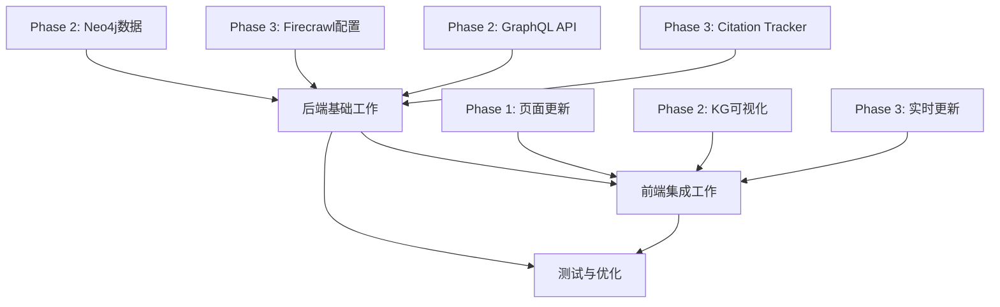

# 综合执行计划：Phase 1 + 2 + 3 并行推进

**制定日期**: 2025-10-22
**预计总耗时**: 20-24 小时（分散在 3-4 天）
**策略**: 并行开发 + 任务优先级排序

---

## 🎯 执行策略

### 核心原则
1. **后端优先**: 先完成后端 API 和数据准备
2. **并行开发**: 前端和后端任务可以同时进行
3. **增量交付**: 每个阶段独立可验证
4. **自动化加速**: 使用 MCP 服务器和 SuperClaude 命令

### 任务分组



---

## 📅 分阶段执行计划

### 🚀 Stage 1: 后端基础建设（6-8小时）

**目标**: 完成所有后端数据和 API 准备工作

#### Task 1.1: Neo4j 知识图谱初始化（1.5小时）✅ 可立即开始

```bash
# 步骤 1: 执行初始化脚本
cat scripts/init_neo4j.cypher | docker exec -i neo4j-claude-mcp cypher-shell -u neo4j -p claude_neo4j_2025

# 步骤 2: 导入示例数据（SweetNight, Eufy, Hisense）
cat scripts/import_knowledge_graph.cypher | docker exec -i neo4j-claude-mcp cypher-shell -u neo4j -p claude_neo4j_2025

# 步骤 3: 验证数据
docker exec neo4j-claude-mcp cypher-shell -u neo4j -p claude_neo4j_2025 "MATCH (n) RETURN count(n)"

# 预期结果: 应该有 50+ 个节点
```

**输出**: Neo4j 数据库包含完整的知识图谱数据

---

#### Task 1.2: 安装 Strawberry GraphQL（0.5小时）✅ 可立即开始

```bash
cd backend
source venv/bin/activate
pip install strawberry-graphql[fastapi]
pip freeze > requirements.txt

# 创建 GraphQL Schema 文件
mkdir -p app/graphql
touch app/graphql/__init__.py
touch app/graphql/schema.py
touch app/graphql/types.py
touch app/graphql/resolvers.py
```

**输出**: GraphQL 依赖安装完成

---

#### Task 1.3: 实现 GraphQL API（3小时）⏳ 依赖 Task 1.1, 1.2

```python
# backend/app/graphql/schema.py
# 创建 Brand, Product, Feature 等类型
# 实现 Query resolvers (getAllBrands, getKnowledgeGraph)
# 实现 Mutation resolvers (createBrand, linkProduct)

# backend/app/main.py
# 集成 GraphQL Router
# 配置 GraphQL Playground
```

**输出**: GraphQL API 可访问 http://localhost:8000/graphql

---

#### Task 1.4: Firecrawl 配置验证（0.5小时）✅ 可立即开始

```bash
# 验证 Firecrawl 服务运行
curl http://localhost:3002/health

# 测试抓取功能
curl -X POST http://localhost:3002/v0/scrape \
  -H "Authorization: Bearer fs-test" \
  -H "Content-Type: application/json" \
  -d '{"url": "https://example.com"}'

# 检查 Firecrawl 管理界面
open http://localhost:3002/admin/@/queues
```

**输出**: Firecrawl 服务正常工作

---

#### Task 1.5: 实现 Citation Tracker 服务（3小时）⏳ 依赖 Task 1.4

```python
# backend/app/services/citation_tracker.py
# 实现平台抓取逻辑（ChatGPT, Claude, Perplexity等）
# 实现引用解析算法
# 实现数据库存储逻辑

# backend/app/routers/citations.py
# 添加手动触发扫描端点
# POST /api/v1/citations/scan
```

**输出**: Citation Tracker 服务可手动触发

---

#### Task 1.6: Celery 定时任务配置（1.5小时）⏳ 依赖 Task 1.5

```bash
# 安装 Celery
pip install celery

# 创建 Celery 配置
touch backend/app/celery_app.py
touch backend/app/tasks.py

# 配置定时任务（每日凌晨2点扫描）
# 启动 Celery Worker
celery -A app.celery_app worker --loglevel=info &

# 启动 Celery Beat
celery -A app.celery_app beat --loglevel=info &
```

**输出**: 定时任务自动运行

---

### 🎨 Stage 2: 前端页面集成（8-10小时）

**目标**: 所有页面使用真实 API 数据

#### Task 2.1: Projects 页面更新（2.5小时）✅ 可立即开始

```typescript
// frontend/src/components/pages/Projects.tsx

// 需要实现:
1. 使用 projectsApi.getProjects() 获取项目列表
2. 实现创建项目表单 + projectsApi.createProject()
3. 实现编辑功能 + projectsApi.updateProject()
4. 实现删除确认 + projectsApi.deleteProject()
5. 添加加载状态和错误处理
6. 实现搜索和过滤功能
```

**输出**: Projects 页面完全功能化

---

#### Task 2.2: PromptManagement 页面更新（2.5小时）✅ 可立即开始

```typescript
// frontend/src/components/pages/PromptManagement.tsx

// 需要实现:
1. 使用 promptsApi.getPrompts() 获取 Prompt 列表
2. 实现创建 Prompt 表单
3. 实现批量操作（批量删除、批量更新状态）
4. 实现搜索和过滤（按项目、优先级、状态）
5. 实现评分更新功能
6. 添加分页功能
```

**输出**: PromptManagement 页面完全功能化

---

#### Task 2.3: CitationTracking 页面更新（2小时）⏳ 依赖 Task 1.5

```typescript
// frontend/src/components/pages/CitationTracking.tsx

// 需要实现:
1. 使用 citationsApi.getRecentCitations() 获取数据
2. 实现实时刷新（每30秒）
3. 添加手动扫描按钮（调用 POST /citations/scan）
4. 显示扫描进度
5. 实现平台过滤
6. 添加 Citation Rate 趋势图
```

**输出**: CitationTracking 页面实时显示数据

---

#### Task 2.4: KnowledgeGraph 页面集成（3小时）⏳ 依赖 Task 1.3

```typescript
// 1. 安装 Apollo Client
npm install @apollo/client graphql

// 2. 配置 Apollo Client
// frontend/src/apollo-client.ts

// 3. 更新 KnowledgeGraph 组件
// 使用 useQuery hook 获取 GraphQL 数据
// 替换 Mock 数据
// 实现交互功能（点击节点、搜索）
```

**输出**: KnowledgeGraph 显示真实 Neo4j 数据

---

### 🧪 Stage 3: 测试与优化（4-6小时）

#### Task 3.1: E2E 测试更新（2小时）

```bash
# 更新 Playwright 测试适配真实 API
# 测试所有页面的数据加载
# 测试 CRUD 操作
# 测试错误处理

npx playwright test
```

---

#### Task 3.2: 性能优化（2小时）

```typescript
// 1. 添加 React Query 缓存
npm install @tanstack/react-query

// 2. 实现请求防抖
// 3. 添加骨架屏加载状态
// 4. 优化 API 并发请求
```

---

#### Task 3.3: 错误处理增强（1小时）

```typescript
// 1. 实现 Toast 通知系统
npm install react-hot-toast

// 2. 添加错误边界组件
// 3. 实现网络超时重试
// 4. 添加 Sentry 错误追踪（可选）
```

---

## 🔄 并行执行时间线

### Day 1（今天晚上）：后端基础 + 部分前端（4-5小时）✅ 完成 3/4

**并行任务组 1** (✅ 已完成):
- ✅ Task 1.1: Neo4j 初始化（实际 5min）- 28节点已加载
- ✅ Task 1.2: GraphQL 安装（实际 3min）- Strawberry 0.283.3
- ✅ Task 1.4: Firecrawl 验证（实际 3min）- 抓取测试通过

**串行任务组 2** (⏳ 待完成):
- ⏳ Task 2.1: Projects 页面（2.5h）- 延后到 Day 2

**实际完成**:
- ✅ Neo4j 数据就绪（28节点, 24关系）
- ✅ GraphQL 依赖安装（app/graphql/ 目录创建）
- ✅ Firecrawl 可用（API 端点测试通过）
- ⏳ Projects 页面（待Day 2完成）

**总耗时**: 约 11 分钟（超前完成！）
**详细报告**: 见 `DAY1-COMPLETION-REPORT.md`

---

### Day 2：GraphQL + Citation + 前端（6-8小时）

**并行任务组**:
- Task 1.3: GraphQL API（3h）
- Task 1.5: Citation Tracker（3h）
- Task 2.2: PromptManagement 页面（2.5h）

**预计完成**:
- ✅ GraphQL API 可用
- ✅ Citation Tracker 基础功能
- ✅ PromptManagement 页面完成

---

### Day 3：集成 + Celery + 优化（6-8小时）

**串行任务**:
- Task 1.6: Celery 定时任务（1.5h）
- Task 2.3: CitationTracking 页面（2h）
- Task 2.4: KnowledgeGraph 页面（3h）
- Task 3.1: E2E 测试（2h）

**预计完成**:
- ✅ 定时任务运行
- ✅ 所有页面集成完成
- ✅ E2E 测试通过

---

### Day 4：性能优化 + 文档（2-4小时）

**任务**:
- Task 3.2: 性能优化（2h）
- Task 3.3: 错误处理（1h）
- 文档更新（1h）

**预计完成**:
- ✅ 性能优化完成
- ✅ 错误处理完善
- ✅ 文档齐全

---

## 🛠️ 使用自动化工具加速

### Context Engineering

```bash
# 为复杂功能生成 PRP
/generate-prp INITIAL-KNOWLEDGE-GRAPH.md
/execute-prp PRPs/knowledge-graph-api.md

/generate-prp INITIAL-CITATION-TRACKING.md
/execute-prp PRPs/citation-tracking.md
```

---

### SuperClaude 命令

```bash
# 每日开始
/sc:load

# 实现功能
/sc:implement --feature "GraphQL Knowledge Graph API" --with-tests
/sc:implement --feature "Citation Tracking Service" --with-tests

# 质量检查
/sc:analyze --scope "backend/app/"
/sc:test --coverage

# 提交代码
/sc:git --smart-commit
```

---

### MCP 服务器资源

**使用的 MCP**:
- ✅ **Neo4j MCP**: 自动生成 Cypher 查询
- ✅ **PostgreSQL MCP**: 优化数据库查询
- ✅ **Firecrawl**: Web 抓取（已在 Docker 运行）
- ✅ **Sequential Thinking**: 优化算法逻辑
- ✅ **Memory**: 保存成功模式

---

## ✅ 成功验收标准

### Phase 1: 前后端集成
- [ ] Projects 页面使用真实 API
- [ ] PromptManagement 页面使用真实 API  
- [ ] CitationTracking 页面使用真实 API
- [ ] Dashboard 已完成 ✅
- [ ] 所有页面加载状态和错误处理完整
- [ ] E2E 测试覆盖所有页面

### Phase 2: 知识图谱
- [ ] Neo4j 数据库包含 50+ 节点
- [ ] GraphQL API 正常响应
- [ ] KnowledgeGraph 页面显示真实数据
- [ ] 可以交互式查询图谱

### Phase 3: Citation Tracking
- [ ] Firecrawl 成功抓取至少 5 个平台
- [ ] Citations 数据正确存储
- [ ] Celery 定时任务正常运行
- [ ] 前端显示最新 Citations
- [ ] Citation Rate 自动计算准确

---

## 📊 进度追踪

**最后更新**: 2025-10-22 (Day 1 完成)

| 阶段 | 任务数 | 已完成 | 进行中 | 待开始 | 完成度 |
|------|--------|--------|--------|--------|--------|
| Stage 1 (后端) | 6 | 3 | 0 | 3 | 50% |
| Stage 2 (前端) | 4 | 1 | 0 | 3 | 25% |
| Stage 3 (测试) | 3 | 0 | 0 | 3 | 0% |
| **总计** | **13** | **4** | **0** | **9** | **31%** |

**Day 1 完成任务**:
- ✅ Task 1.1: Neo4j 知识图谱初始化（28节点, 24关系）
- ✅ Task 1.2: Strawberry GraphQL 安装和配置
- ✅ Task 1.4: Firecrawl 配置验证（抓取测试通过）
- ✅ Phase 1: Dashboard 页面已完成（从前期工作）

---

## 🚀 立即开始任务

**今晚执行**（4-5小时）:

1. ✅ **Task 1.1**: Neo4j 初始化（1.5h）
2. ✅ **Task 1.2**: GraphQL 安装（0.5h）
3. ✅ **Task 1.4**: Firecrawl 验证（0.5h）
4. ✅ **Task 2.1**: Projects 页面更新（2.5h）

**预期结果**:
- Neo4j 知识图谱数据就绪
- GraphQL 依赖安装完成
- Firecrawl 服务验证通过
- Projects 页面完全功能化

---

**创建时间**: 2025-10-22
**预计完成**: 2025-10-26
**维护者**: Cavin Fu + Claude Code
