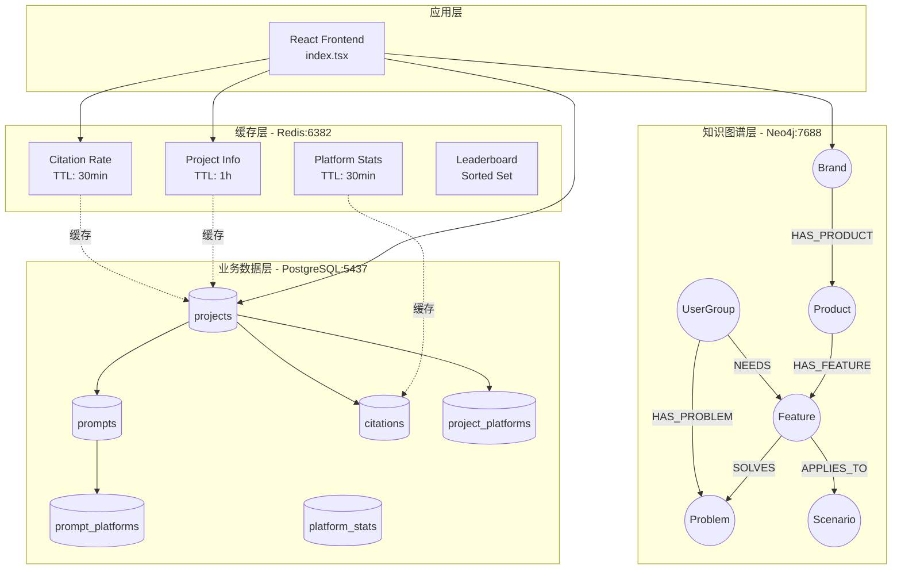
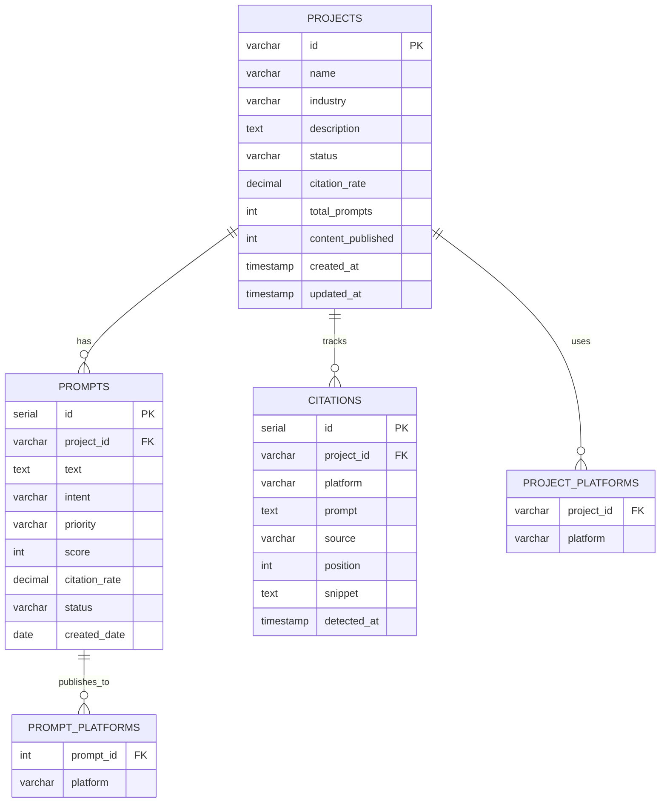
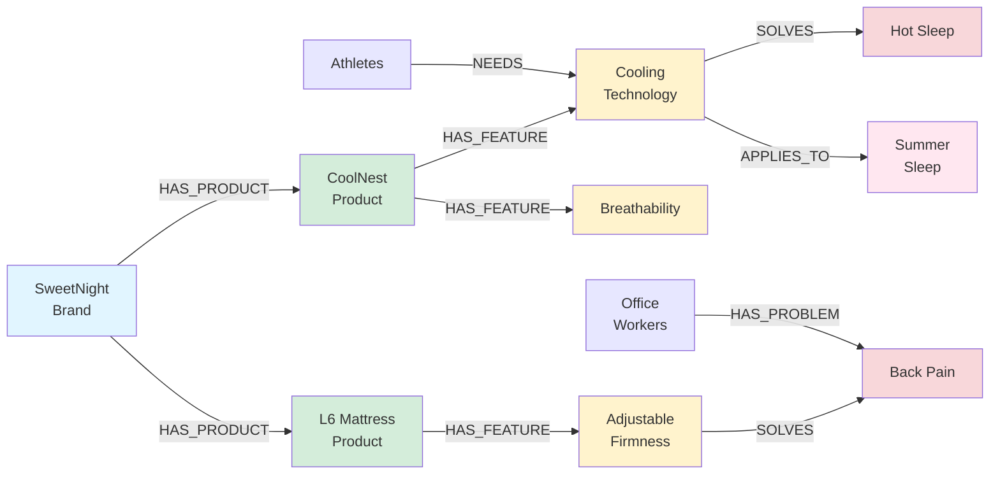
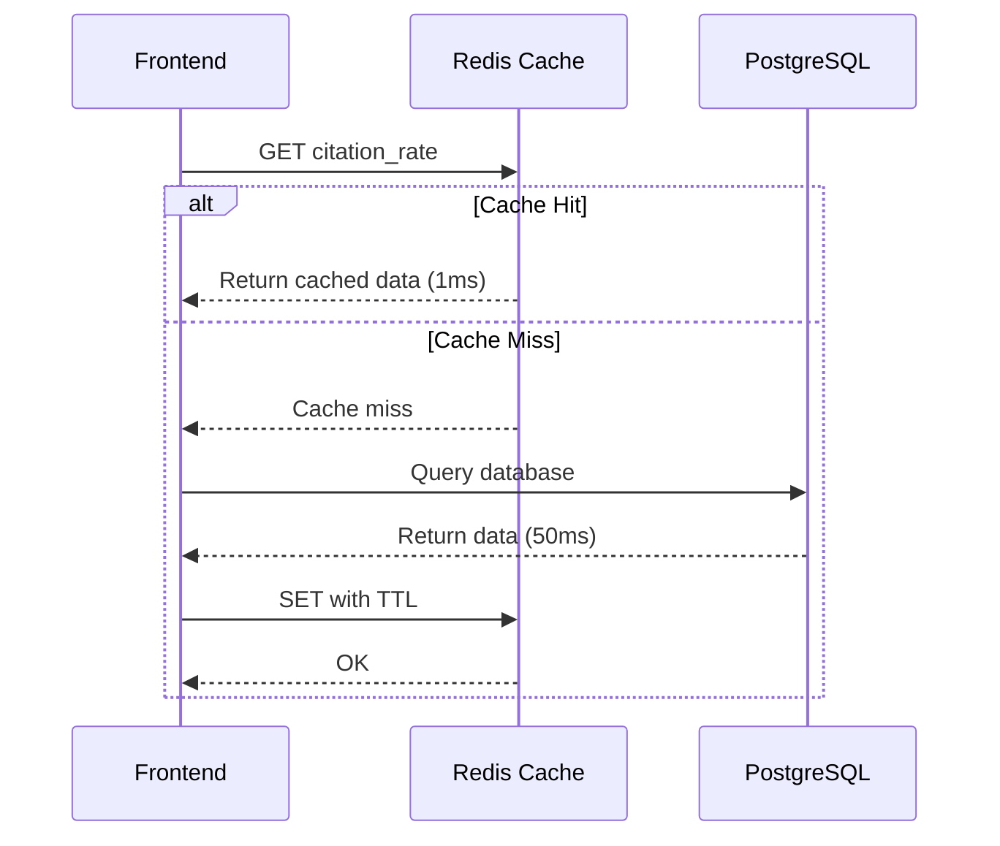
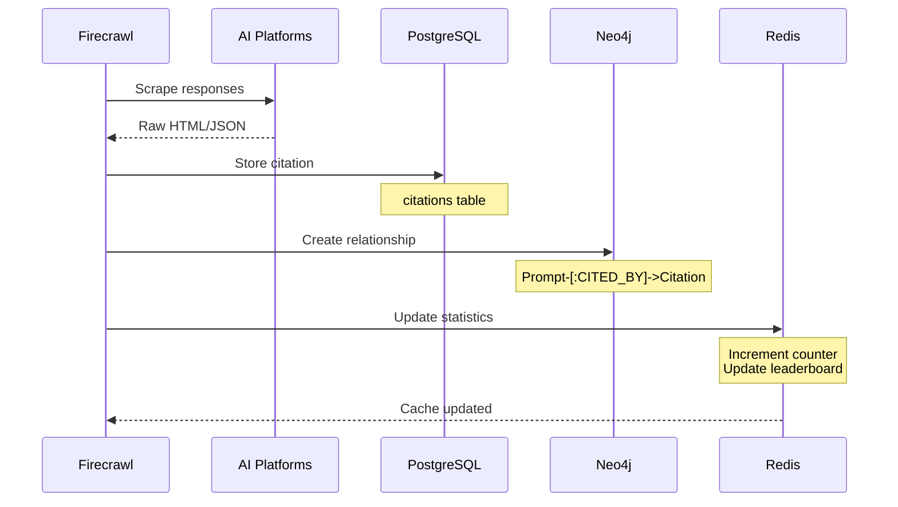
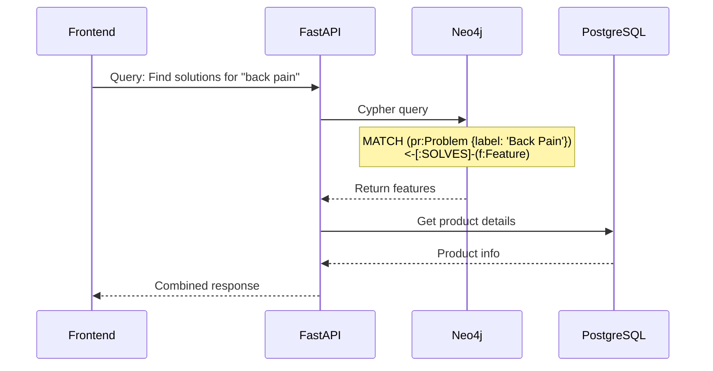

# GEO Platform 数据架构图

## 🏗️ 三层数据架构



---

## 📊 PostgreSQL 数据模型



---

## 🕸️ Neo4j 知识图谱模型

### SweetNight 项目示例



### 节点类型说明

| 节点类型 | 颜色 | 描述 | 数量 |
|---------|------|------|------|
| 🔵 Brand | 蓝色 | 品牌 | 3 |
| 🟢 Product | 绿色 | 产品线 | 7 |
| 🟡 Feature | 黄色 | 产品特性 | 7 |
| 🔴 Problem | 红色 | 用户痛点 | 5 |
| 🟣 UserGroup | 紫色 | 目标用户群 | 4 |
| 🟠 Scenario | 橙色 | 使用场景 | 2 |

### 关系类型说明

| 关系类型 | 描述 | 示例 | 数量 |
|---------|------|------|------|
| HAS_PRODUCT | 品牌拥有产品 | SweetNight → CoolNest | 7 |
| HAS_FEATURE | 产品具有特性 | CoolNest → Cooling Tech | 7 |
| SOLVES | 特性解决问题 | Cooling Tech → Hot Sleep | 4 |
| APPLIES_TO | 特性适用场景 | Cooling Tech → Summer | 2 |
| NEEDS | 用户需要特性 | Athletes → Cooling Tech | 1 |
| HAS_PROBLEM | 用户有痛点 | Office Workers → Back Pain | 2 |
| BENEFITS | 特性受益用户 | Self-Empty → Busy Professionals | 1 |

---

## 💾 Redis 缓存架构

### 键命名规范

```
geo:project:{project_id}:info               # 项目基本信息 (JSON)
geo:project:{project_id}:citation_rate      # Citation Rate (String)
geo:project:{project_id}:prompt_count       # Prompt 数量 (String)
geo:project:{project_id}:platform:{platform}:citations  # 平台引用数 (String)
geo:citation_rate_leaderboard               # 排行榜 (Sorted Set)
```

### 缓存策略

| 数据类型 | TTL | 更新频率 | 失效策略 |
|---------|-----|---------|---------|
| 项目信息 | 1 小时 | 低频 | 被动失效 |
| Citation Rate | 30 分钟 | 中频 | 主动刷新 |
| 平台统计 | 30 分钟 | 高频 | 主动刷新 |
| 排行榜 | 永久 | 实时 | 主动更新 |

### 缓存流程



---

## 🔄 数据流转流程

### 1. Citation 追踪流程



### 2. 知识图谱查询流程



---

## 📈 性能优化设计

### PostgreSQL 索引策略

```sql
-- 高频查询索引
CREATE INDEX idx_prompts_project ON prompts(project_id);
CREATE INDEX idx_prompts_status ON prompts(status);
CREATE INDEX idx_citations_project_date ON citations(project_id, detected_at);
CREATE INDEX idx_citations_platform ON citations(platform);

-- 复合索引
CREATE INDEX idx_platform_stats_project_date
    ON platform_stats(project_id, date);
```

### Neo4j 查询优化

```cypher
-- 创建唯一性约束（自动创建索引）
CREATE CONSTRAINT brand_id FOR (b:Brand) REQUIRE b.id IS UNIQUE;
CREATE CONSTRAINT product_id FOR (p:Product) REQUIRE p.id IS UNIQUE;

-- 常用查询模式（已优化）
MATCH (b:Brand {project_id: $projectId})-[:HAS_PRODUCT]->(p:Product)
RETURN b, p
```

### Redis 内存优化

```bash
# 使用合适的数据结构
SETEX geo:project:sweetnight:info 3600 "{...}"  # String with TTL
ZADD geo:leaderboard 0.32 "sweetnight"          # Sorted Set (高效排序)
HINCRBY geo:stats:sweetnight citations 1        # Hash (节省内存)
```

---

## 🔒 数据安全设计

### 1. 连接安全
- ✅ PostgreSQL: 密码认证 + 端口限制 (5437)
- ✅ Neo4j: 用户名密码 + Bolt 协议 (7688)
- ✅ Redis: 密码认证 (claude_redis_2025)
- ✅ 所有凭证存储在 `~/.mcp.env` (权限 600)

### 2. 数据完整性
- ✅ 外键约束 (PostgreSQL)
- ✅ 唯一性约束 (Neo4j)
- ✅ 输入验证 (Pydantic - 待实现)
- ✅ 事务保证 (ACID)

### 3. 备份策略
```bash
# PostgreSQL 备份
docker exec postgres-claude-mcp pg_dump -U claude claude_dev > backup.sql

# Neo4j 备份
docker exec neo4j-claude-mcp neo4j-admin database dump neo4j --to-path=/backups

# Redis 备份 (AOF enabled)
docker exec redis-claude-mcp redis-cli -a claude_redis_2025 BGSAVE
```

---

## 📊 数据统计总览

### 当前数据规模

| 数据库 | 存储对象 | 数量 | 增长率 |
|-------|---------|------|-------|
| PostgreSQL | 记录数 | 67 | 预计 1000+/月 |
| Neo4j | 节点数 | 28 | 预计 100+/项目 |
| Neo4j | 关系数 | 24 | 预计 200+/项目 |
| Redis | 缓存键 | 15 | 动态变化 |

### 存储空间估算

| 数据库 | 当前大小 | 1 年后预估 | 优化建议 |
|-------|---------|-----------|---------|
| PostgreSQL | <1 MB | ~500 MB | 定期归档旧数据 |
| Neo4j | <5 MB | ~2 GB | 清理无用关系 |
| Redis | <1 MB | ~10 MB | TTL 自动清理 |

---

## 🎯 数据质量保证

### 验证清单

- [x] PostgreSQL: 无孤立记录
- [x] PostgreSQL: 外键完整性 100%
- [x] Neo4j: 项目隔离验证
- [x] Neo4j: 无悬空关系
- [x] Redis: 跨库一致性 100%
- [x] Redis: TTL 正常工作
- [x] 性能测试通过 (<100ms)

### 数据监控指标

```python
# 关键监控指标
metrics = {
    'postgresql_connections': 5,        # 连接数
    'postgresql_query_time_p95': 45,    # 查询时间 P95 (ms)
    'neo4j_query_time_p95': 80,         # 图查询时间 P95 (ms)
    'redis_hit_rate': 0.85,             # 缓存命中率
    'redis_memory_usage': '2.5MB',      # 内存使用
    'data_consistency': 1.0             # 数据一致性 (100%)
}
```

---

## 🚀 扩展性设计

### 水平扩展策略

1. **PostgreSQL 读写分离**
   - Master: 写操作
   - Replica: 读操作
   - 连接池: pgBouncer

2. **Neo4j 集群**
   - Causal Cluster (3+ nodes)
   - Read Replicas for query scaling

3. **Redis 集群**
   - Redis Cluster (Sharding)
   - Redis Sentinel (High Availability)

### 垂直扩展建议

| 组件 | 当前配置 | 推荐配置 (生产) |
|------|---------|----------------|
| PostgreSQL | 默认 | CPU: 4核, RAM: 8GB |
| Neo4j | 默认 | CPU: 4核, RAM: 16GB |
| Redis | 默认 | RAM: 4GB |

---

*Generated by Claude Code*
*Project: leapgeo2 - GEO Platform*
*Date: 2025-10-09*
