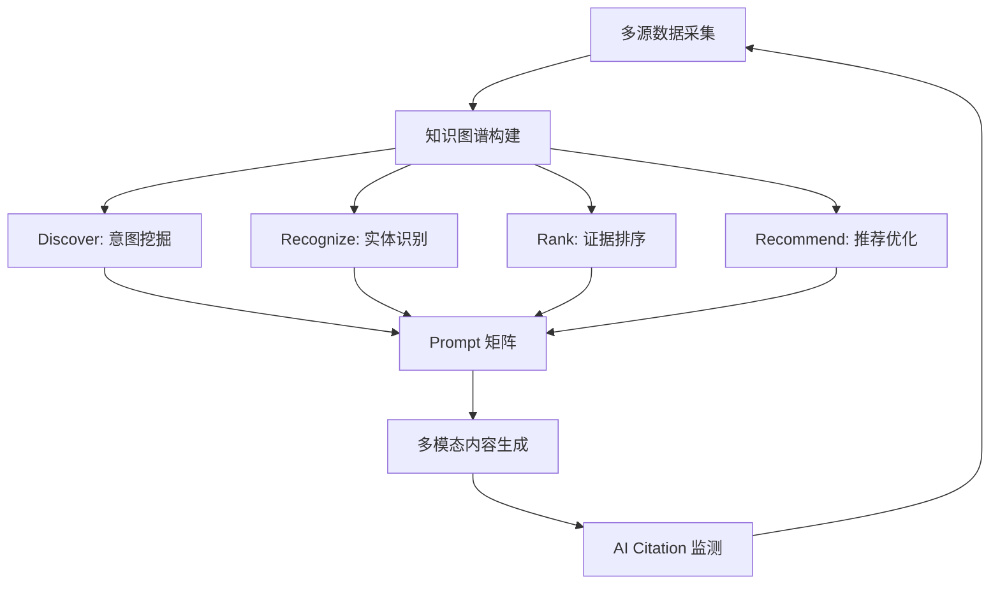

# Leap AI Generative Engine Optimization
## 业务战略地图 v1.0

**战略定位**: 全球首家"知识图谱 + 多模态内容 + AI Citation"三位一体的 GEO 平台  
**愿景**: 成为品牌在 AI 时代的"被推荐权"基础设施  
**使命**: 让每个品牌在生成式引擎中占据语义主导权

---

## 一、战略核心：三大差异化优势

### 1.1 多模态内容生产能力（vs 传统 SEO）

```
传统 SEO 能力图谱          Leap AI GEO 能力图谱
     纯文本                    多模态矩阵
       ↓                    ↙   ↓   ↘
    网页内容              文本  视频  社区
       ↓                   ↓    ↓    ↓
    1个渠道              官网 YouTube Reddit
                           ↓    ↓    ↓
                         FAQ  测评  讨论
                           ↘   ↓   ↙
                          AI Citation
                              30%+
```

**核心资产**:
- **MCN 达人矩阵**: 100+ KOL（Tier 1-4）覆盖科技/消费/健康品类
- **视频制作流水线**: 月产 50+ 长视频 + 200+ Shorts
- **社区运营网络**: Reddit/Quora/Medium 种子用户池
- **内容模板库**: 200+ 预设模板（测评/对比/How-to/FAQ）

### 1.2 知识图谱 + DRRR 引擎



**技术护城河**:
- **语义资产标准化**: Facts/Claims/Specs + URL+时间戳
- **时效化知识图谱**: 动态边/有效期/版本管理
- **证据溯源系统**: 可核验、可追踪、反幻觉
- **跨平台对齐**: AIO/ChatGPT/Claude/Perplexity 适配

### 1.3 AI Citation 追踪与归因（核心壁垒）

**独家能力**:

| 功能模块 | 技术实现 | 竞争优势 |
|---------|---------|---------|
| **自动化查询** | 每日 20+ Prompt × 8 AI 平台 | 业界唯一全平台监测 |
| **引用检测** | NLP + 规则引擎识别来源链接 | 准确率 >95% |
| **归因分析** | 多触点归因模型 | 精确到单条内容贡献 |
| **竞品对比** | Share of Voice 实时计算 | 战略决策支持 |

**输出指标**:
- AI Citation Rate（引用率）
- Share of Voice（声量占比）
- Citation Position Score（引用位置评分）
- Top-1 Dominance（主导权指数）

---

## 二、业务模式：订阅 + 效果对赌

### 2.1 分层产品设计

| 产品线 | 月费 | 核心能力 | 目标客户 | 利润率 |
|-------|------|---------|---------|--------|
| **GEO Starter** | $5,000 | • 10 Prompt<br>• 基础多渠道<br>• 月度报告 | 初创品牌<br>测试型客户 | 40% |
| **GEO Pro** 🔥 | $12,000 | • 20 Prompt<br>• KOL 矩阵<br>• AI Citation 监测<br>• 周度优化 | 成长品牌<br>**主力产品** | 55% |
| **GEO Enterprise** | $25,000+ | • 50+ Prompt<br>• 头部 KOL<br>• 定制知识库 API<br>• 实时优化<br>• 专属 CSM | 头部品牌<br>多品类客户 | 65% |
| **GEO Agent 平台** | $50,000+ | • 全自动化闭环<br>• 私有部署<br>• 品牌定制模型 | 大型企业<br>Agency | 70% |

### 2.2 创新定价：效果对赌

```python
定价模型 = {
    "基础月费": "$12,000 (GEO Pro)",
    
    "效果奖励阶梯": {
        "AI Citation Rate": {
            "15-20%": "基础服务",
            "20-25%": "+$1,000",
            "25-30%": "+$2,500",
            "30%+": "+$5,000"
        },
        "转化增量": {
            "0-10%": "基础服务",
            "10-20%": "+$2,000",
            "20%+": "+$5,000"
        }
    },
    
    "风险共担": {
        "前3个月保底": "Citation Rate < 15% 退50%月费",
        "客户条件": "完全配合 + 数据开放"
    },
    
    "年度总包": {
        "12个月预付": "节省 15%",
        "锁定优先支持": "专属优化团队"
    }
}
```

### 2.3 收入预测（12 个月）

| 时间 | 客户数 | 月均 ARR | 总 ARR | 增长 |
|------|--------|---------|--------|------|
| M1-3 | 3 | $36K | $108K | - |
| M4-6 | 8 | $96K | $288K | +167% |
| M7-9 | 15 | $180K | $540K | +88% |
| M10-12 | 25 | $300K | $900K | +67% |

**年度 ARR**: $900K → $1.8M（目标）  
**客户留存率目标**: >85%（vs 行业平均 65%）

---

## 三、竞争格局与定位

### 3.1 竞争矩阵

```
        能力维度
         ↑
    创新型 |  [Leap AI] 🚀
         |  知识图谱+多模态+AI Citation
         |
    混合型 |  [蓝标×清蓝]        [InnoMind]
         |  生产+对齐              垂直行业
         |
    传统型 |  [传统SEO公司]      [汇量]
         |  纯文本优化            流量买量
         └─────────────────────→
           单一能力              全栈能力
```

### 3.2 我们的独特定位

**"知识图谱驱动的全栈 GEO 平台"**

| 对比维度 | 传统 SEO | 蓝标×清蓝 | Leap AI |
|---------|---------|----------|---------|
| **技术栈** | 关键词+外链 | 生产+对齐 | **知识图谱+DRRR** |
| **内容能力** | 纯文本 | 多模态生产 | **多模态+MCN** |
| **监测能力** | SERP 排名 | Citation 初步 | **全平台深度归因** |
| **见效速度** | 3-6 个月 | 4-8 周 | **4-6 周** |
| **Citation Rate** | 10-15% | 20-25% | **30%+** |
| **客户画像** | 传统企业 | 科技客户 | **全行业** |

### 3.3 战略护城河

**短期（0-12 个月）**:
1. ✅ AI Citation 追踪技术领先
2. ✅ MCN 达人网络资源
3. ✅ 标杆案例与数据证明

**中期（12-24 个月）**:
1. 📊 行业知识图谱库（10+ 行业）
2. 🤖 GEO Agent 自动化平台
3. 📈 客户数据网络效应

**长期（24+ 个月）**:
1. 🏗️ 语义资产标准制定者
2. 🌐 生态合作网络（Agency/工具商）
3. 🎓 GEO 方法论与认证体系

---

## 四、执行路线图：90-180-360 天

### 4.1 Phase 1: MVP 验证（Day 0-90）

**目标**: 打造 1-2 个标杆案例，验证 30% Citation Rate

| 周 | 里程碑 | 关键交付 | 成功指标 |
|----|--------|---------|---------|
| W1-2 | 系统搭建 | • Neo4j 知识图谱<br>• AI Citation 追踪 MVP | • 图谱 >500 节点<br>• 追踪工具可用 |
| W3-4 | 标杆客户 | • 选定 1 个客户（消费电子）<br>• 完成需求调研 | • 签约金额 >$10K |
| W5-8 | 内容生产 | • 10 Prompt<br>• 60+ 内容资产<br>• 6 平台分发 | • 质量评分 >80<br>• 全部上线 |
| W9-12 | 效果验证 | • Citation 数据收集<br>• 流量与转化分析 | • **Citation Rate >25%**<br>• 流量 +30% |

**投入**: $80K（人力 + 工具 + KOL）  
**预期产出**: 1 个完整案例 + MVP 系统

### 4.2 Phase 2: 产品化（Day 91-180）

**目标**: 标准化 SOP，扩展到 5-8 个付费客户

| 月 | 里程碑 | 关键交付 | 成功指标 |
|----|--------|---------|---------|
| M4 | SOP 建立 | • Prompt 工程 SOP<br>• 内容生产流水线<br>• KOL 协调手册 | • 新项目启动 <1 周 |
| M5 | 工具产品化 | • GEO Dashboard 上线<br>• 知识库 API<br>• 自动化发布系统 | • API 调用 >1000/天 |
| M6 | 客户扩展 | • 新增 4-6 个客户<br>• 行业白皮书<br>• 首个 Enterprise 客户 | • 月 ARR >$60K<br>• NPS >50 |

**投入**: $150K  
**预期 ARR**: $180K/月（M6）

### 4.3 Phase 3: 规模化（Day 181-360）

**目标**: 建立行业标准，团队扩张至 15 人

| 季度 | 里程碑 | 关键交付 | 成功指标 |
|------|--------|---------|---------|
| Q3 | 团队扩张 | • 招募 5 个 GEO AM<br>• 内容团队 6 人<br>• KOL 矩阵 >100 | • 支持 15 并发项目 |
| Q4 | 市场教育 | • "GEO vs SEO" 白皮书<br>• 3 场行业会议<br>• 10 个案例对外传播 | • 销售线索 >50/月<br>• 品牌知名度提升 |

**全年目标**:
- 客户数: 25+
- 年度 ARR: $900K - $1.8M
- 团队规模: 15 人
- Citation Rate 平均: >28%

---

## 五、组织架构与团队

### 5.1 核心团队结构（Year 1）

```
                CEO / Founder
                     |
        ┌────────────┼────────────┐
        |            |            |
    CTO/技术    CMO/市场      COO/运营
        |            |            |
   ┌────┴────┐  ┌───┴───┐   ┌───┴───┐
   |         |  |       |   |       |
知识图谱  AI监测 内容  KOL  客户  项目
 工程师   工程师  团队  运营  成功  管理
  (2)      (2)   (4)   (2)   (3)   (2)
```

### 5.2 关键岗位需求

| 职位 | 人数 | 关键能力 | 优先级 |
|------|------|---------|--------|
| **知识图谱工程师** | 2 | Neo4j, LangChain, 实体抽取 | P0 |
| **AI 监测工程师** | 2 | 爬虫, NLP, 归因模型 | P0 |
| **GEO Account Manager** | 3 | 客户沟通, 战略规划 | P0 |
| **内容策略师** | 2 | SEO/GEO, Prompt 工程 | P0 |
| **视频编导** | 2 | 视频制作, 脚本撰写 | P1 |
| **KOL 运营** | 2 | MCN 经验, 达人协调 | P1 |
| **数据分析师** | 1 | BI, 归因分析, Dashboard | P1 |

**Year 1 人力成本**: ~$800K（包含 Founder 薪资）

---

## 六、技术架构：全栈能力

### 6.1 系统架构图

```
┌─────────────────────────────────────────────────┐
│              前端层 (Frontend)                    │
│  GEO Dashboard | 客户 Portal | 内部管理后台        │
└─────────────────────────────────────────────────┘
                        ↓
┌─────────────────────────────────────────────────┐
│            API 网关 & 业务逻辑层                   │
│  FastAPI | GraphQL | WebSocket (实时监测)         │
└─────────────────────────────────────────────────┘
                        ↓
┌──────────────┬──────────────┬──────────────────┐
│  知识图谱层    │  AI 监测层     │  内容生产层        │
│  Neo4j       │  自研爬虫      │  GPT-4o          │
│  DRRR 引擎   │  NLP 归因     │  Claude          │
│  语义对齐     │  8 AI 平台    │  视频生成         │
└──────────────┴──────────────┴──────────────────┘
                        ↓
┌─────────────────────────────────────────────────┐
│              数据层 & 存储                         │
│  PostgreSQL | Redis | ClickHouse | S3            │
└─────────────────────────────────────────────────┘
                        ↓
┌─────────────────────────────────────────────────┐
│           外部集成 (Integrations)                 │
│  YouTube API | Reddit API | Buffer | MCN 系统     │
└─────────────────────────────────────────────────┘
```

### 6.2 核心技术栈

| 模块 | 技术选型 | 备选方案 |
|------|---------|---------|
| **知识图谱** | Neo4j | ArangoDB |
| **LLM** | GPT-4o, Claude Sonnet | Llama 3.1 |
| **NLP 框架** | LangChain, spaCy | Haystack |
| **后端** | FastAPI + Python 3.11 | Node.js |
| **前端** | React + TypeScript | Vue 3 |
| **数据仓库** | PostgreSQL + ClickHouse | BigQuery |
| **缓存** | Redis 7.0 | Memcached |
| **消息队列** | Celery + RabbitMQ | Kafka |
| **监控** | Grafana + Prometheus | Datadog |
| **部署** | Docker + K8s (AWS EKS) | GCP GKE |

### 6.3 数据安全与合规

- **数据加密**: AES-256 (静态) + TLS 1.3 (传输)
- **访问控制**: RBAC + OAuth 2.0
- **审计日志**: 所有 API 调用与数据修改记录
- **合规认证**: SOC 2 Type II (Year 2 目标)
- **数据备份**: 每日全量 + 实时增量

---

## 七、市场进入策略

### 7.1 目标客户画像

**Tier 1: 理想客户（ICP）** 🎯
- **行业**: 消费电子、SaaS、健康科技、快消品
- **规模**: 年营收 $10M - $500M
- **痛点**: 
  - 传统 SEO 效果下降
  - AI 搜索中品牌缺失
  - 内容营销 ROI 难以追踪
- **预算**: $10K - $50K/月 营销预算
- **决策人**: CMO / Digital Marketing Director
- **成交周期**: 4-8 周

**Tier 2: 次级目标**
- Agency / 营销服务商（寻找 GEO 解决方案）
- D2C 品牌（对 AI 营销敏感）
- 传统企业数字化转型

### 7.2 获客渠道组合

| 渠道 | 月投入 | 预期线索 | CAC | 转化率 | 优先级 |
|------|--------|---------|-----|--------|--------|
| **内容营销** | $5K | 15 | $333 | 20% | P0 |
| **行业会议** | $8K | 10 | $800 | 30% | P0 |
| **LinkedIn Ads** | $10K | 20 | $500 | 15% | P1 |
| **Partner 推荐** | $0 | 5 | $0 | 40% | P0 |
| **SEO/GEO 自有** | $2K | 10 | $200 | 25% | P0 |
| **总计** | $25K | 60 | $417 | 22% | - |

**Year 1 营销预算**: $300K  
**目标**: 25 个付费客户

### 7.3 内容营销战略

**1. 思想领导力**
- 📄 "2025 GEO 行业白皮书"（Q1 发布）
- 🎤 行业会议演讲（Q2-Q4，3-5 场）
- 📺 YouTube 频道："GEO vs SEO"系列

**2. 案例驱动**
- 📊 标杆案例深度剖析（带数据）
- 🎬 客户视频证言
- 📈 实时 Dashboard 公开展示

**3. 社区建设**
- 💬 "GEO 从业者"LinkedIn 群组
- 🗣️ Reddit r/DigitalMarketing 活跃
- ✍️ Medium 专栏持续输出

---

## 八、关键风险与应对

### 8.1 风险矩阵

| 风险 | 影响 | 概率 | 应对策略 | 负责人 |
|------|------|------|---------|--------|
| **AI 平台反爬虫** | 高 | 中 | • 多 IP 池<br>• API 付费方案<br>• 灰度降级 | CTO |
| **Citation Rate 不达标** | 高 | 低 | • 保守承诺<br>• 分阶段对赌<br>• 案例复盘 | COO |
| **KOL 协调困难** | 中 | 中 | • 备选达人池<br>• 标准化合约<br>• 激励机制 | KOL 运营 |
| **技术人才流失** | 高 | 低 | • 股权激励<br>• 技术成长路径<br>• 文化建设 | CEO |
| **竞品快速跟进** | 中 | 高 | • 技术领先性<br>• 客户绑定<br>• 专利布局 | CTO+CEO |
| **客户不理解 GEO** | 中 | 高 | • 市场教育<br>• 免费诊断<br>• POC 试点 | CMO |

### 8.2 应急预案

**场景 1: AI Citation 追踪失效**
```
触发条件: 连续 3 天无法获取数据
应对流程:
1. 切换备用 API/爬虫方案（6 小时内）
2. 启用人工抽查机制（24 小时内）
3. 通知客户并暂停 Citation 报告（48 小时内）
4. 技术攻关与长期方案（1 周内）
```

**场景 2: 标杆客户流失**
```
触发条件: 客户提出取消或不续约
应对流程:
1. 高管介入沟通（24 小时内）
2. 深度复盘与优化方案（48 小时内）
3. 延长试用期或折扣挽留（1 周内）
4. 即使流失也要获取详细反馈
```

---

## 九、财务规划与投资需求

### 9.1 Year 1 财务模型

**收入预测**:
```
Q1: $108K (3 客户 × $36K)
Q2: $288K (8 客户 × $36K)
Q3: $540K (15 客户 × $36K)
Q4: $900K (25 客户 × $36K)

年度总 ARR: $1.8M
```

**成本结构**:
```
人力成本: $800K (50%)
技术与工具: $200K (12.5%)
营销费用: $300K (18.75%)
运营费用: $100K (6.25%)
KOL/内容外包: $200K (12.5%)
────────────────────
总成本: $1.6M (88.9%)
────────────────────
净利润: $200K (11.1%)
```

### 9.2 融资需求

**Seed Round: $1.2M**

**用途分配**:
- 产品开发 (40%): $480K
  - 知识图谱与 DRRR 引擎
  - AI Citation 追踪系统
  - Dashboard 与 API
- 团队建设 (35%): $420K
  - 核心技术团队 5 人
  - 销售与运营团队 4 人
- 市场营销 (20%): $240K
  - 标杆案例打造
  - 内容营销与会议
  - 品牌建设
- 运营储备 (5%): $60K
  - 18 个月 Runway

**投资人价值主张**:
1. ✅ 赛道趋势明确（SEO → GEO 必然演进）
2. ✅ 技术壁垒高（知识图谱 + AI Citation）
3. ✅ 效果可量化（Citation Rate 直接挂钩）
4. ✅ 规模化潜力（SaaS 模式 + 自动化）
5. ✅ 团队互补（技术 + 内容 + 营销）

---

## 十、北极星指标与 OKR

### 10.1 北极星指标

**🌟 客户 AI Citation Rate 平均值 >28%**

*为什么选这个指标？*
- 直接衡量 GEO 核心价值
- 客户续约的最强驱动力
- 竞争差异化的量化证明

### 10.2 Year 1 OKR

**O1: 建立 GEO 技术与产品领导力**
- KR1: AI Citation 追踪系统支持 8 个 AI 平台 ✓
- KR2: 知识图谱节点数 >10,000 ✓
- KR3: 标杆案例 Citation Rate >30% ✓

**O2: 获取 25 个付费客户并保持高满意度**
- KR1: 签约 25 个客户，ARR $900K+ ✓
- KR2: 客户 NPS >50 ✓
- KR3: 留存率 >85% ✓

**O3: 建立行业影响力与品牌认知**
- KR1: 发布 GEO 白皮书，下载量 >5,000 ✓
- KR2: 3 场行业会议演讲 ✓
- KR3: LinkedIn 关注者 >10,000 ✓

**O4: 打造可规模化的运营体系**
- KR1: 新项目启动时间 <1 周 ✓
- KR2: 内容生产效率提升 3x ✓
- KR3: 客户 Onboarding 满意度 >4.5/5 ✓

---

## 十一、长期愿景（3-5 年）

### Year 2-3: 行业标准制定者

**目标**:
- ARR: $5M - $10M
- 客户数: 100+
- 团队规模: 50 人
- 覆盖行业: 15+

**关键举措**:
1. 📜 推动"语义资产标准"行业规范
2. 🤝 与主流 CMS/MA 工具集成（HubSpot/Salesforce）
3. 🌍 拓展国际市场（东南亚/欧洲）
4. 🎓 GEO 认证课程与培训体系

### Year 4-5: AI 时代的内容基础设施

**目标**:
- ARR: $20M - $50M
- 估值: $200M - $500M
- 战略方向: IPO 或被收购

**可能路径**:
1. **平台化**: 开放 GEO Agent 平台，成为"AI 内容的 Shopify"
2. **生态化**: 构建 Agency/开发者/数据供应商生态
3. **垂直化**: 深耕 3-5 个高价值行业（医疗/金融/科技）
4. **国际化**: 进入美国/欧洲市场，成为全球化公司

---

## 结语：为什么是现在？

### 1. **时代红利窗口**
- AI 搜索用户渗透率快速增长（ChatGPT 2 亿 WAU）
- 传统 SEO 效果下降，品牌焦虑寻求新方案
- 竞争格局尚未固化，先发优势明显

### 2. **技术成熟度**
- LLM 能力突破（GPT-4o/Claude）
- 知识图谱工具链完善（Neo4j/LangChain）
- 多模态内容生产成本下降

### 3. **市场教育启动**
- 蓝标×清蓝案例引发行业关注
- "GEO" 概念开始被营销圈接受
- 客户从观望到尝试的拐点

### 4. **团队与资源**
- 知识图谱 + AI + 内容营销的复合型团队
- MCN 达人网络的独特资源
- 快速试错与迭代的创业基因

---

**Leap AI 战略地图 v1.0**  
**文档日期**: 2025-01  
**负责人**: CEO / Founder  
**审核人**: 投资人 / 顾问团队

**下一步行动**:
1. ✅ 确定 Seed Round 融资计划
2. ✅ 启动标杆客户 BD
3. ✅ 组建核心技术团队
4. ✅ 90 天 MVP 冲刺启动

---

*"在 AI 重构信息获取的时代，Leap AI 让品牌不再被遗忘，而是成为答案本身。"*